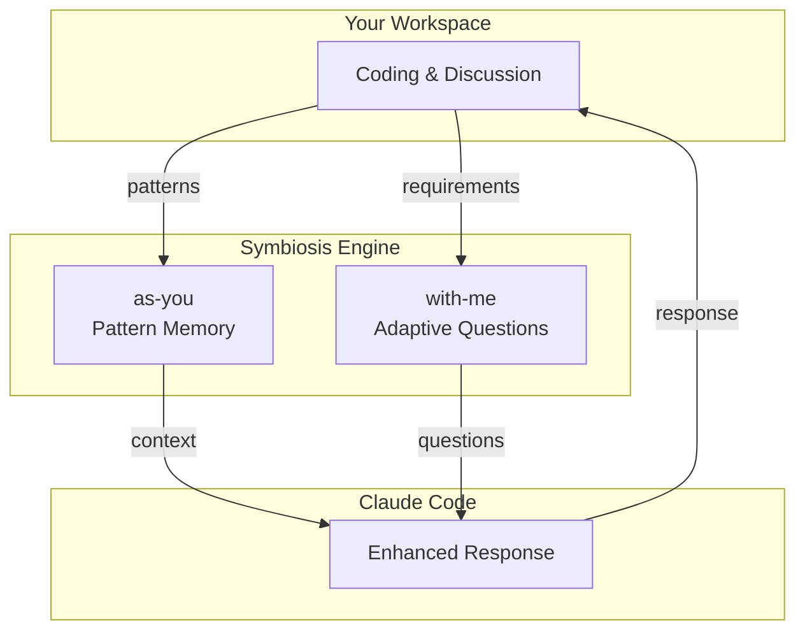

# Symbiosis

[](https://www.python.org/downloads/)
[](https://github.com/h315uk3/symbiosis/actions/workflows/test.yml)
[](https://github.com/h315uk3/symbiosis/actions/workflows/codeql.yml)

**A minimalist engine for Human-AI collaboration.**

> Install and use immediately. No setup. No configuration. No external services.

I built this because I wanted to see how far we can extend human cognition using only Python's standard library and fundamental algorithms. No heavy dependencies, no black boxes—just information theory, cognitive science, and a desire for a more "natural" partnership with AI.

It's still in its early stages, but it has already become indispensable for my own daily requirement analysis. I'd love to hear your thoughts on whether this interdisciplinary approach makes sense to you.

## What It Does

Two plugins that extend Claude Code:

- **as-you** — Your extended memory. Learns patterns, retrieves them when relevant.
- **with-me** — Your thinking partner. Asks the right questions to clarify requirements.

## Architecture



## The Approach: 6 Academic Fields, Zero Dependencies

| Algorithm | Field | Purpose |
|-----------|-------|---------|
| BM25 | Information Retrieval | Relevance scoring for pattern matching |
| SM-2 | Cognitive Science | Spaced repetition for memory scheduling |
| Thompson Sampling | Reinforcement Learning | Exploration vs exploitation trade-off |
| Shannon Entropy | Information Theory | Convergence detection in requirements |
| Bayesian Update | Probability Theory | Belief refinement from answers |
| Expected Information Gain | Decision Theory | Optimal question selection |

**All implemented in Python standard library only.** No NumPy. No ML frameworks. Just `math`, `json`, `pathlib`.

## Why Standard Library Only?

- **Zero-setup**: Install and use immediately—no configuration, no environment setup
- **Portability**: Works anywhere Python runs
- **Auditability**: Read the source—no hidden dependencies
- **Privacy**: All processing local, zero network calls
- **Stability**: No dependency conflicts, no supply chain risks

## Quick Start

Add the marketplace:

```
/plugin marketplace add h315uk3/symbiosis
```

Install plugins:

```
/plugin install as-you@h315uk3-symbiosis
/plugin install with-me@h315uk3-symbiosis
```

## Usage

Teach a pattern (explicit learning):

```
/as-you:learn "Always use pathlib instead of os.path"
```

Adaptive requirement elicitation:

```
/with-me:good-question
```

## Deep Dive

- [as-you: Technical Overview](./plugins/as-you/docs/technical-overview.md)
- [with-me: Technical Overview](./plugins/with-me/docs/technical-overview.md)

## License

GNU AGPL v3 - [LICENSE](LICENSE)

## Contributing

See [CONTRIBUTING.md](CONTRIBUTING.md)
