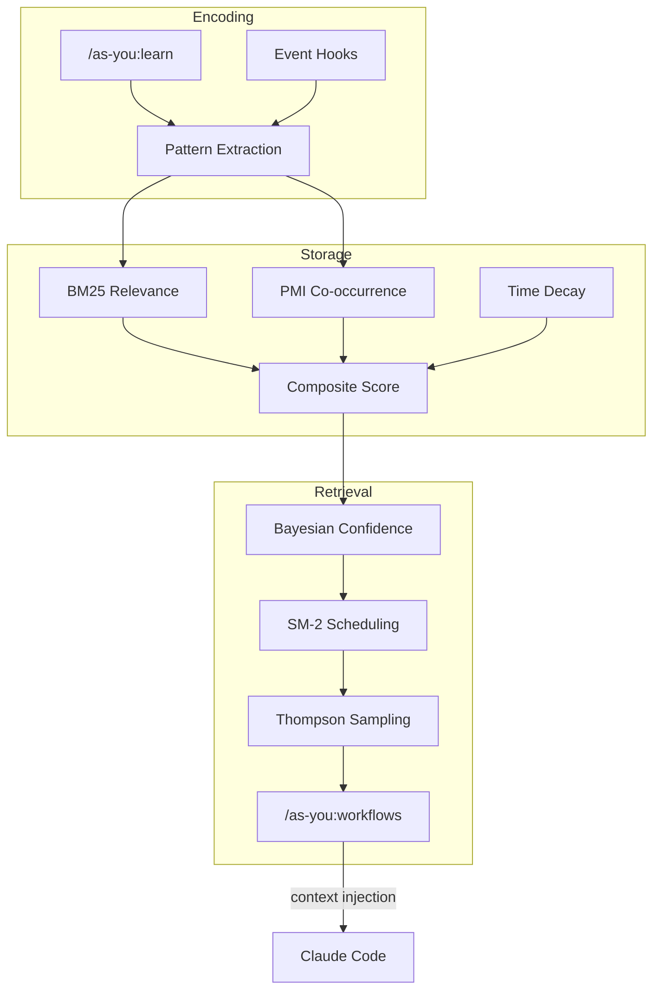

# As You - Technical Documentation

This document provides detailed technical information about the As You plugin's architecture, algorithms, configuration, and data structures.

---

## Table of Contents

- [How It Works](#how-it-works)
- [Available Commands](#available-commands)
- [Statistical Intelligence](#statistical-intelligence)
- [Configuration](#configuration)
- [Data Storage](#data-storage)
- [Development](#development)
- [References](#references)
- [Philosophy](#philosophy)

---

## How It Works

### Cognitive Loop Architecture



Your coding patterns are mathematically optimized for re-presentation at the right moment.

### Automatic Learning Flow

```
1. During Session
   /as-you:learn "Investigating authentication feature bug"
   → Saved to <workspace>/.claude/as_you/session_notes.local.md

2. On SessionEnd (Automatic)
   → Archive session_notes.local.md
   → Save as <workspace>/.claude/as_you/session_archive/2026-01-22.md

3. Pattern Analysis & Scoring (Automatic)
   → Extract patterns from archive
   → Calculate BM25 relevance scores
   → Apply time decay (30-day half-life)
   → Track Bayesian confidence
   → Schedule SM-2 memory reviews
   → Compute composite scores
   → Auto-merge similar patterns (Levenshtein distance)
   → Save to <workspace>/.claude/as_you/pattern_tracker.json

4. Promotion Notification (Automatic)
   → Display patterns with high composite scores + confidence
   → Viewable with /as-you:patterns
   → Thompson Sampling balances proven vs. uncertain patterns

5. Knowledge Application (Manual)
   → /as-you:workflows to manage workflows
   → /as-you:patterns to promote patterns to skills/agents
   → Save workflows for reuse
```

Patterns are automatically extracted from your session notes using statistical intelligence, building your personal knowledge base over time.

---

## Available Commands

```bash
# Learning (note taking + pattern capture)
/as-you:learn "text"     # Add timestamped note
/as-you:learn            # Learning dashboard (interactive)

# Patterns (pattern analysis + SM-2 review + confidence tracking + promotion)
/as-you:patterns         # Pattern dashboard: analysis, review, promotion

# Workflows (save and execute procedures)
/as-you:workflows "name" # Save workflow
/as-you:workflows        # View and execute workflows (interactive)

# Active Learning (automatic capture)
/as-you:active on        # Enable automatic prompt and edit capture
/as-you:active off       # Disable automatic capture
/as-you:active status    # Show current status and statistics

# Help
/as-you:help             # Show detailed documentation
```

---

## Statistical Intelligence

### Scoring System

The plugin uses multiple statistical approaches to identify and prioritize patterns:

#### BM25 Scoring

Relevance ranking with term saturation (replaces TF-IDF):

$$\text{BM25}(d, q) = \sum_{t \in q} \text{IDF}(t) \cdot \frac{f(t, d) \cdot (k_1 + 1)}{f(t, d) + k_1 \cdot (1 - b + b \cdot \frac{|d|}{\text{avgdl}})}$$

- $f(t, d)$: term frequency in document
- $k_1 = 1.5$: term frequency saturation
- $b = 0.75$: length normalization

#### Ebbinghaus Forgetting Curve

Models memory decay with repetition-based strengthening:

$$R(t) = e^{-t/s}$$

where:
- $t$: time elapsed since last seen (days)
- $s$: memory strength = base_strength + (growth_factor × repetition_count)
- $R(t)$: retention rate at time $t$

**Key properties:**
- Repeated patterns have higher $s$ → slower decay
- Single occurrences decay faster
- Based on Ebbinghaus (1885) forgetting curve research

#### Time Decay

Models information freshness with exponential decay:

$$D(t) = 0.5^{t/h}$$

where:
- $t$: time elapsed since last seen (days)
- $h$: half-life (default: 30 days)
- $D(t)$: freshness score at time $t$

**Key properties:**
- Uniform decay rate regardless of repetition
- Measures temporal relevance (recency)
- Complements Ebbinghaus by adding freshness dimension

**Difference from Ebbinghaus:**
- **Ebbinghaus**: Evaluates learning quality (how well it's learned)
- **Time Decay**: Evaluates information freshness (how recent it is)
- **Combined**: Balances established knowledge with recent trends

#### Bayesian Confidence

Tracks certainty using posterior distribution:

$$p(\theta | x) = \frac{p(x | \theta) \cdot p(\theta)}{p(x)}$$

Maintains mean $\mu$, variance $\sigma^2$, and 95% confidence interval $[\mu - 1.96\sigma, \mu + 1.96\sigma]$.

#### SM-2 Memory Algorithm

Spaced repetition with adaptive intervals based on consecutive successful reviews:

$$I(r) = \begin{cases} 1 & \text{if } r = 0 \\ 6 & \text{if } r = 1 \\ I_{\text{prev}} \cdot EF & \text{if } r \geq 2 \end{cases}$$

where $r$ is the number of consecutive successful reviews (repetitions), $I_{\text{prev}}$ is the previous interval, and $EF$ (Easiness Factor) adapts based on quality assessment: $EF' = \max(1.3, EF + (0.1 - (5 - q) \cdot (0.08 + (5 - q) \cdot 0.02)))$

**Interactive Review:**
- Patterns are scheduled for review based on SM-2 intervals
- Access review workflow via `/as-you:patterns` → "Review pattern quality"
- Quality ratings (0-5) assess pattern usefulness and update next review date
- Low quality assessment ($q < 3$) resets: $I = 1$, $r = 0$

#### Thompson Sampling

Balances exploration vs. exploitation using Beta distribution:

$$\theta_i \sim \text{Beta}(\alpha_i, \beta_i)$$

- Select pattern with highest sampled $\theta_i$
- Update: $\alpha_i \leftarrow \alpha_i + r$, $\beta_i \leftarrow \beta_i + (1 - r)$
- Balances proven patterns (high $\alpha$) with uncertain ones (low $\alpha + \beta$)

**Usage:**
- Thompson states are automatically updated during pattern analysis
- Pattern selection uses Thompson Sampling when retrieving pattern context
- Each pattern samples from Beta($\alpha$, $\beta$) and highest samples are selected
- High-confidence patterns (large $\alpha$) are likely selected (exploitation)
- Low-confidence patterns (small $\alpha + \beta$) have chances to explore

#### Composite Scoring
- **Purpose**: Weighted combination of multiple metrics
- **Default weights**:
  - BM25: 30% (relevance)
  - PMI: 20% (co-occurrence)
  - Ebbinghaus: 30% (memory strength)
  - Time Decay: 20% (freshness)
- **Configurable**: Adjust in `config/as-you.json`

### Pattern Management

- **Automatic Extraction**: Patterns emerge from 3+ similar observations
- **Automatic Merging**: Similar patterns unified using Levenshtein distance and BK-trees
- **Context-Aware Retrieval**: Get relevant patterns for current task
- **Workflow Capture**: Save and reuse action sequences

---

## Configuration

**File:** `plugins/as-you/config/as-you.json`

```json
{
  "version": 1,
  "scoring": {
    "bm25": {
      "enabled": true,
      "k1": 1.5,        // Term frequency saturation
      "b": 0.75         // Length normalization
    },
    "pmi": {
      "enabled": true,
      "min_cooccurrence": 2,
      "window_size": 5
    },
    "time_decay": {
      "enabled": true,
      "half_life_days": 30  // Days for score to decay to 50%
    },
    "weights": {
      "bm25": 0.3,          // Relevance weight
      "pmi": 0.2,           // Co-occurrence weight
      "ebbinghaus": 0.3,    // Memory strength weight
      "time_decay": 0.2     // Freshness weight
    }
  },
  "memory": {
    "ebbinghaus": {
      "enabled": true,
      "base_strength": 1.0,     // Base memory strength (days)
      "growth_factor": 0.5      // Strength increase per repetition
    },
    "sm2": {
      "enabled": true,
      "initial_easiness": 2.5,
      "min_easiness": 1.3
    }
  },
  "confidence": {
    "bayesian": {
      "enabled": true,
      "prior_mean": 0.5,     // Neutral prior
      "prior_variance": 0.04
    },
    "thompson_sampling": {
      "enabled": true,
      "initial_alpha": 1.0,
      "initial_beta": 1.0
    }
  },
  "diversity": {
    "shannon_entropy": {
      "enabled": true,
      "context_keys": ["sessions"],     // Contexts to track
      "aggregation": "mean",            // Aggregation method
      "max_contexts": 10                // Maximum contexts to consider
    }
  },
  "categories": [
    "preference",    // User preferences and choices
    "style",         // Coding style and conventions
    "process",       // Development processes
    "decision",      // Technical decisions
    "observation",   // General observations
    "workflow"       // Work procedures
  ],
  "habits": {
    "deduplication_threshold": 0.9,    // Similarity threshold for duplicates
    "clustering_threshold": 0.85,      // Threshold for grouping similar notes
    "min_confidence": 0.5,             // Minimum confidence for habit extraction
    "min_freshness": 0.3,              // Minimum freshness score
    "freshness_half_life_days": 30     // Days for freshness to decay to 0.5
  },
  "promotion": {
    "threshold": 0.3,         // Minimum composite score
    "min_observations": 3,    // Minimum frequency
    "min_confidence": 0.6     // Minimum Bayesian confidence
  }
}
```

### Configuration Sections Explained

#### Diversity Tracking

Measures pattern diversity using Shannon entropy to avoid redundant information:

- **shannon_entropy.enabled**: Enable diversity scoring
- **context_keys**: Which contexts to analyze (e.g., "sessions", "files")
- **aggregation**: How to combine entropy values ("mean", "max", "min")
- **max_contexts**: Maximum number of contexts to track (limits memory usage)

**Use case**: Prevents presenting too many similar patterns; encourages exploration of diverse knowledge areas.

#### Categories

Predefined classification system for organizing notes and patterns:

- **preference**: User's stated preferences and choices
- **style**: Coding style, formatting, naming conventions
- **process**: Development workflows and methodologies
- **decision**: Technical architecture and design decisions
- **observation**: General insights and learnings
- **workflow**: Specific action sequences and procedures

**Use case**: Enables semantic organization and filtering of patterns by type.

#### Habits

Configuration for extracting recurring behavioral patterns:

- **deduplication_threshold**: Similarity score (0-1) above which notes are considered duplicates
  - Higher value (e.g., 0.95) = more strict, only near-exact matches
  - Lower value (e.g., 0.8) = more lenient, catches variations
- **clustering_threshold**: Minimum similarity for grouping related notes
  - Used to identify patterns that co-occur frequently
- **min_confidence**: Minimum confidence score (0-1) to extract as habit
  - Higher value requires more evidence before establishing a pattern
- **min_freshness**: Minimum freshness score (0-1) for inclusion
  - Filters out patterns that haven't been used recently
- **freshness_half_life_days**: Days for freshness score to decay to 0.5
  - Implements exponential decay: score = 2^(-days / half_life)
  - Shorter half-life prioritizes recent activity

**Use case**: Automatically identifies recurring practices and preferences from your development history.

### Tuning Tips

**Increase recent pattern importance:**
- Lower `base_strength` (e.g., 0.5)
- Increase `ebbinghaus` weight (e.g., 0.4)

**Prioritize relevance over memory strength:**
- Increase `bm25` weight (e.g., 0.5)
- Decrease `ebbinghaus` weight (e.g., 0.2)

**Strengthen repetition effect:**
- Increase `growth_factor` (e.g., 1.0)
- Patterns gain memory strength faster with repetition

**More aggressive promotion:**
- Lower `threshold` (e.g., 0.2)
- Lower `min_confidence` (e.g., 0.5)

**Conservative promotion:**
- Raise `threshold` (e.g., 0.4)
- Raise `min_confidence` (e.g., 0.7)

**Adjust habit extraction sensitivity:**
- Lower `deduplication_threshold` (e.g., 0.8) for stricter duplicate detection
- Raise `clustering_threshold` (e.g., 0.9) for tighter grouping of similar notes
- Adjust `min_confidence` (e.g., 0.7) to require higher certainty for habit extraction

**Control pattern freshness decay:**
- Increase `freshness_half_life_days` (e.g., 60) to keep patterns relevant longer
- Decrease (e.g., 15) to prioritize very recent patterns
- Raise `min_freshness` (e.g., 0.5) to filter out older patterns more aggressively

---

## Data Storage

**Location:** `<workspace>/.claude/as_you/`

(Where `<workspace>` is your Claude Code workspace root directory)

See `/as-you:help` for file descriptions. Explore the directory for actual structure.

**Pattern Tracker Schema:**

> **Note**: Schema shown for reference; implementation may evolve. Field names and structure are subject to change in future versions.

```json
{
  "patterns": {
    "pattern text": {
      "count": 5,
      "last_seen": "2026-01-22",
      "bm25_score": 0.842,
      "pmi_score": 0.651,
      "ebbinghaus_score": 0.945,
      "time_decay_score": 0.887,
      "composite_score": 0.812,
      "bayesian_state": {
        "mean": 0.75,
        "variance": 0.02
      },
      "sm2_state": {
        "easiness_factor": 2.6,
        "interval": 15,
        "repetitions": 3
      }
    }
  },
  "promotion_candidates": ["pattern1", "pattern2"],
  "cooccurrences": [...]
}
```

---

## References

### Algorithms

- **BM25**: Robertson & Zaragoza (2009). "The Probabilistic Relevance Framework: BM25 and Beyond"
- **PMI (Pointwise Mutual Information)**: Church & Hanks (1990). "Word Association Norms, Mutual Information, and Lexicography"
- **Ebbinghaus Forgetting Curve**: Ebbinghaus (1885). "Memory: A Contribution to Experimental Psychology"; Murre & Dros (2015). "Replication and Analysis of Ebbinghaus' Forgetting Curve"
- **SM-2**: Wozniak (1990). "Optimization of Learning" - SuperMemo algorithm
- **Bayesian Inference**: Bishop (2006). "Pattern Recognition and Machine Learning"
- **Thompson Sampling**: Agrawal & Goyal (2012). "Analysis of Thompson Sampling for the Multi-armed Bandit Problem"
- **Levenshtein Distance**: Levenshtein (1966). "Binary codes capable of correcting deletions, insertions, and reversals"
- **BK-tree**: Burkhard & Keller (1973). "Some approaches to best-match file searching"

### Implementation

- Python standard library only
- No ML frameworks (TensorFlow, PyTorch, etc.)
- No NLP libraries (NLTK, spaCy, transformers)
- Transparent, auditable algorithms

---

## Philosophy

### Explicit Over Implicit
You choose what to capture. No automatic surveillance or passive tracking.

### Statistical Intelligence
Proven mathematical approaches, not black-box models. Every score is explainable.

### Local-First
Your data stays on your machine. No cloud services, no authentication required.

### Progressive Accumulation
Knowledge builds gradually from repeated patterns. Quality emerges from quantity.

---

## Contributing

See [CONTRIBUTING.md](../../../CONTRIBUTING.md) for development setup, testing, and contribution guidelines.
