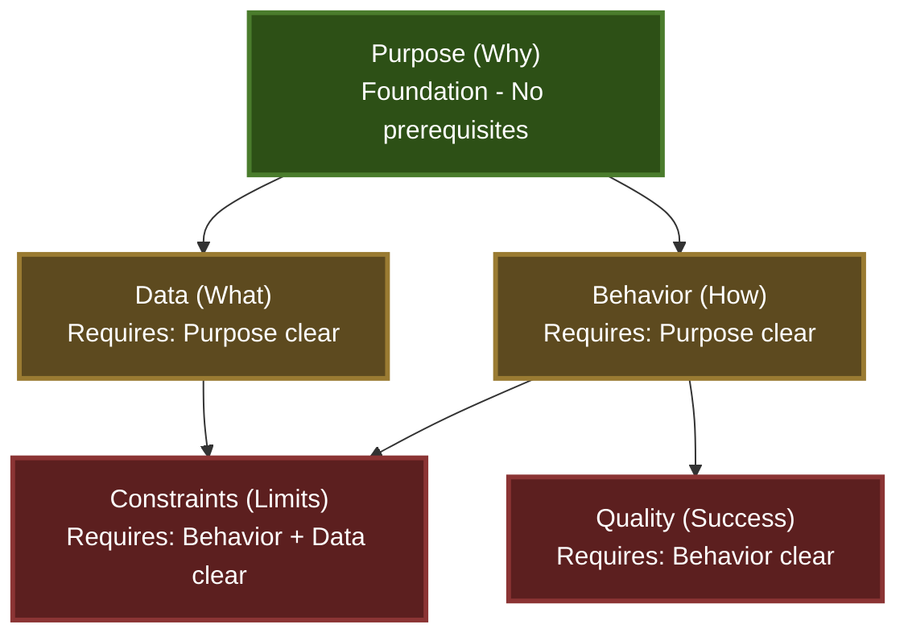

# Good Question

**When you can't articulate your requirements, let me ask the right questions.**

This command uses an information-theoretic approach to extract requirements by reducing uncertainty (entropy) through adaptive questioning.

---

## Core Principle: Entropy Reduction

Your requirements exist in an uncertain state. Each question aims to maximize information gain, systematically reducing entropy until clarity emerges.

```
Initial State: H(Requirements) = High (Maximum Uncertainty)
↓ Question 1 (Max Info Gain)
State After Q1: H(Requirements|A1) = Reduced
↓ Question 2 (Max Remaining Info Gain)
State After Q2: H(Requirements|A1,A2) = Further Reduced
↓ ...
Terminal State: H(Requirements|All Answers) < Threshold (Sufficient Clarity)
```

---

## Uncertainty Dimensions

Track implicit uncertainty across five key dimensions:

### 1. Purpose (Why)
- What problem is being solved?
- Who benefits from this?
- What is the core value?

### 2. Data (What)
- What information is involved?
- What are the inputs and outputs?
- What transformations occur?

### 3. Behavior (How)
- What actions take place?
- What triggers the functionality?
- What is the step-by-step flow?

### 4. Constraints (Limits)
- What technical limitations exist?
- What performance requirements matter?
- What compatibility needs exist?

### 5. Quality (Success)
- How is success measured?
- What edge cases exist?
- What could go wrong?

---

## Dimension Dependencies (DAG Structure)

**CRITICAL: Dimensions have prerequisite relationships. Always check dependencies before selecting the next dimension.**



**Dependency Rules:**

1. **Purpose** (Foundation)
   - No prerequisites
   - Must be addressed first if unclear
   - Gates: Data, Behavior

2. **Data**
   - Prerequisite: Purpose < 0.4 (sufficiently clear)
   - Rationale: Cannot define data requirements without understanding the problem

3. **Behavior**
   - Prerequisite: Purpose < 0.4 (sufficiently clear)
   - Rationale: Cannot define workflow without understanding the goal
   - Gates: Constraints, Quality

4. **Constraints**
   - Prerequisites: Behavior < 0.4 AND Data < 0.4 (both clear)
   - Rationale: Constraints require understanding both what the system does and what data it processes
   - Example: "15fps processing" is meaningless without knowing data volume and format

5. **Quality**
   - Prerequisite: Behavior < 0.4 (sufficiently clear)
   - Rationale: Success criteria primarily depend on expected behavior
   - Data specifics are helpful but not required for defining test scenarios

**Dimension Selection Algorithm:**

```python
# 1. Filter dimensions by prerequisites
def can_ask_dimension(dim, uncertainties):
    prerequisites = {
        "purpose": [],
        "data": ["purpose"],
        "behavior": ["purpose"],
        "constraints": ["behavior", "data"],  # Requires both Behavior and Data
        "quality": ["behavior"]  # Requires only Behavior
    }

    for prereq in prerequisites[dim]:
        if uncertainties[prereq] > 0.4:  # Threshold: >0.4 = unclear
            return False
    return True

# 2. Select highest uncertainty among askable dimensions
askable_dims = {
    dim: unc
    for dim, unc in uncertainties.items()
    if can_ask_dimension(dim, uncertainties)
}

next_dimension = max(askable_dims, key=askable_dims.get)
```

**Example Scenarios:**

```
Scenario 1: Purpose unclear, Behavior has highest uncertainty
uncertainties = {"purpose": 0.7, "data": 0.5, "behavior": 0.8, "constraints": 0.6}

Without DAG: Select "behavior" (highest = 0.8)
With DAG: Select "purpose" (behavior blocked by purpose prerequisite)
```

```
Scenario 2: Purpose clear, Behavior unclear
uncertainties = {"purpose": 0.2, "data": 0.5, "behavior": 0.8, "constraints": 0.6}

Without DAG: Select "behavior" (highest = 0.8)
With DAG: Select "behavior" (prerequisite satisfied ✓)
```

---

## Interview Protocol

### Phase 0: Reference Collection (Optional)

Before beginning the interview, check if the developer has reference materials to save for easy access during the session.

**Ask using AskUserQuestion:**
- Question: "Do you have reference materials to save for this session?"
- Header: "References"
- multiSelect: false
- Options:
  - Label: "Git repository", Description: "Clone a repository to /tmp for reference"
  - Label: "Documentation URL", Description: "Fetch documentation to /tmp"
  - Label: "Local files", Description: "Copy local files to /tmp for reference"
  - Label: "No references", Description: "Continue without saving references"

**If references provided:**
- Git repository: Use Bash tool to `git clone <url> /tmp/ref-<timestamp>-<project>`
- Documentation: Use Bash tool to `curl <url> -o /tmp/ref-<timestamp>-doc.pdf` or `wget <url> -P /tmp/`
- Local files: Use Bash tool to `cp <path> /tmp/ref-<timestamp>-<name>`

**Benefits:**
- References remain accessible throughout the session
- Can be examined later during questioning
- Faster than repeatedly fetching the same resources
- /tmp is automatically cleaned on system restart

**Note:** This phase is optional and can be skipped if the developer has no references or prefers to provide them inline during questioning.

---

### Phase 1: Initial Assessment

**Start tracking this question session:**

```bash
SESSION_ID=$(bash "${CLAUDE_PLUGIN_ROOT}/scripts/commands/good-question-impl.sh" start | jq -r '.session_id')
```

Store `SESSION_ID` in a variable for use throughout this session.

---

Begin with an open question to gauge overall clarity:

**Ask using AskUserQuestion:**
- Question: "What do you want to build?"
- Header: "Starting Point"
- multiSelect: false
- Options:
  - Label: "Let me explain", Description: "I'll describe what I have in mind"
  - Label: "Show you examples", Description: "I have references or similar implementations"
  - Label: "Just a goal", Description: "I know what I want to achieve but not how"

**Based on response:**
- Detailed explanation → Assess which dimensions are clear vs uncertain
- Examples provided → Use Read/Grep/WebFetch to understand, then assess gaps
- Just a goal → Start with Purpose dimension (highest uncertainty)

---

### Phase 2: Structured Questioning

**Three-stage approach to ensure completeness and detect contradictions:**

1. **Phase 2-1: Initial Survey** - Ask each dimension once (guarantees completeness)
2. **Phase 2-2: DAG-based Deep Dive** - Follow DAG order for efficient clarification
3. **Phase 2-3: Contradiction Resolution** - Resolve any detected inconsistencies

---

#### Phase 2-1: Initial Survey (Completeness Guarantee)

**Goal:** Ensure all dimensions are addressed at least once, preventing `answered: false` (uncertainty = 1.0) from remaining.

**Process:**

Ask **one lightweight question** for each dimension in this fixed order:
1. Purpose
2. Data
3. Behavior
4. Constraints
5. Quality

**IMPORTANT:**
- Ask **brief, open-ended questions** to get initial context
- Do NOT deep-dive yet - save detailed follow-ups for Phase 2-2
- Even if user says "not sure", mark dimension as `answered: true` with high uncertainty
- Goal: All dimensions reach `answered: true`, uncertainties typically 0.5-0.8

**After Initial Survey:**
```bash
# All dimensions now have answered: true
# Calculate uncertainties (will be 0.5-0.8 range typically)
UNCERTAINTIES=$(python3 "${CLAUDE_PLUGIN_ROOT}/scripts/uncertainty_calculator.py" "$DIMENSION_DATA_JSON")
```

Expected result:
```json
{
  "purpose": 0.6,    // answered: true, brief response
  "data": 0.8,       // answered: true, user said "not sure"
  "behavior": 0.7,   // answered: true, partial explanation
  "constraints": 0.5,
  "quality": 0.7
}
```

All dimensions are now in the system. None will remain at 1.0.

---

#### Phase 2-2: DAG-based Deep Dive (Efficient Clarification)

**Goal:** Reduce uncertainties below threshold (< 0.3) following logical DAG order.

**Process:**

At each iteration:
1. **Calculate current uncertainties** (with English translation)
2. **Apply DAG filter** to identify askable dimensions
3. **Select highest uncertainty** among askable dimensions
4. **Ask detailed, targeted questions** for that dimension
5. **Detect cross-dimension contradictions** (see below)

**Question templates below are organized by dimension. Use these for deep-dive questions.**

#### If Purpose has highest uncertainty:

**Ask using AskUserQuestion:**
- Question: "What problem does this solve?"
- Header: "Purpose"
- multiSelect: false
- Options:
  - Label: "Describe the problem", Description: "Let me explain the problem I'm trying to solve"
  - Label: "User needs", Description: "There's a specific user need or pain point"
  - Label: "Technical requirement", Description: "This is needed for technical reasons"

Follow up with:
- "Who experiences this problem?"
- "What happens if this isn't built?"
- "What does success look like from the user's perspective?"

#### If Data has highest uncertainty:

**Ask using AskUserQuestion:**
- Question: "What data is involved?"
- Header: "Data"
- multiSelect: false
- Options:
  - Label: "Describe the data", Description: "Let me explain the data structure and flow"
  - Label: "Show examples", Description: "I have sample data or schemas"
  - Label: "Not sure yet", Description: "I haven't thought about the data structure"

Follow up with:
- "What triggers data to enter the system?"
- "What format is the data in?"
- "What information must be preserved vs transformed?"

#### If Behavior has highest uncertainty:

**Ask using AskUserQuestion:**
- Question: "What should happen step by step?"
- Header: "Behavior"
- multiSelect: false
- Options:
  - Label: "Walk through it", Description: "Let me describe the flow step by step"
  - Label: "Similar to existing", Description: "It works like [reference] but with differences"
  - Label: "Uncertain", Description: "I'm not sure about the exact flow"

Follow up with:
- "What initiates this process?"
- "What are the critical decision points?"
- "When does the process complete?"

#### If Constraints have highest uncertainty:

**Ask using AskUserQuestion:**
- Question: "Any constraints I should know about?"
- Header: "Constraints"
- multiSelect: true
- Options:
  - Label: "Performance critical", Description: "Speed, memory, or latency requirements"
  - Label: "Security sensitive", Description: "Authentication, authorization, or data protection"
  - Label: "Compatibility needs", Description: "Must work with specific versions or systems"
  - Label: "No specific constraints", Description: "Standard practices are fine"

For each selected constraint, drill deeper:
- Performance: "What are the acceptable thresholds?"
- Security: "What are the threat scenarios?"
- Compatibility: "What must be supported?"

#### If Quality has highest uncertainty:

**Ask using AskUserQuestion:**
- Question: "How do you know it works correctly?"
- Header: "Quality"
- multiSelect: false
- Options:
  - Label: "Describe test cases", Description: "I can explain what scenarios to test"
  - Label: "Follow standards", Description: "Apply standard testing practices"
  - Label: "Not sure", Description: "I need help defining success criteria"

Follow up with:
- "What are the critical success scenarios?"
- "What edge cases concern you?"
- "What failure modes should be handled?"

---

**Cross-Dimension Contradiction Detection:**

After each answer in Phase 2-2, check for contradictions with prerequisite dimensions:

```python
def detect_contradictions(current_dim, current_answer, dimension_data):
    """
    Detect semantic contradictions between current answer and prerequisites.

    Examples of contradictions:
    - Purpose: "for streamers" + Data: "enterprise customer database"
    - Behavior: "real-time processing" + Constraints: "batch processing acceptable"
    - Data: "video files" + Constraints: "must work in text-only terminals"
    """
    contradictions = []

    if current_dim == "data":
        purpose_content = dimension_data.get("purpose", {}).get("content", "").lower()
        current_lower = current_answer.lower()

        # Check for user-type mismatches
        if any(word in purpose_content for word in ["streamer", "individual", "creator"]):
            if any(word in current_lower for word in ["enterprise", "corporate", "organization"]):
                contradictions.append({
                    "type": "purpose-data mismatch",
                    "prereq_dim": "purpose",
                    "reason": "Target users (individuals) don't typically use enterprise-scale data"
                })

    if current_dim == "behavior":
        purpose_content = dimension_data.get("purpose", {}).get("content", "").lower()
        current_lower = current_answer.lower()

        # Check for complexity mismatches
        if "simple" in purpose_content or "basic" in purpose_content:
            if any(word in current_lower for word in ["complex workflow", "multi-stage", "orchestration"]):
                contradictions.append({
                    "type": "purpose-behavior mismatch",
                    "prereq_dim": "purpose",
                    "reason": "Purpose mentions simplicity, but behavior describes complex processes"
                })

    if current_dim == "constraints":
        behavior_content = dimension_data.get("behavior", {}).get("content", "").lower()
        data_content = dimension_data.get("data", {}).get("content", "").lower()
        current_lower = current_answer.lower()

        # Check for processing-type conflicts
        if "real-time" in behavior_content or "streaming" in behavior_content:
            if "batch" in current_lower:
                contradictions.append({
                    "type": "behavior-constraints conflict",
                    "prereq_dim": "behavior",
                    "reason": "Behavior describes real-time processing, but constraint allows batch"
                })

        # Check for data-format conflicts
        if "video" in data_content or "image" in data_content:
            if "text-only" in current_lower or "cli" in current_lower:
                contradictions.append({
                    "type": "data-constraints conflict",
                    "prereq_dim": "data",
                    "reason": "Data includes media files, but constraints limit to text-only environment"
                })

    return contradictions
```

**When contradictions are detected:**

1. **Immediately notify user:**
   ```
   ⚠️ Potential contradiction detected:

   [Dimension 1]: "user statement"
   [Dimension 2]: "conflicting statement"

   Reason: [explanation]
   ```

2. **Ask user to clarify** using AskUserQuestion:
   - Question: "I noticed a potential contradiction. Which is correct?"
   - Header: "Clarification"
   - Options:
     - Label: "[Dimension 1] is correct", Description: "Update [Dimension 2] to align"
     - Label: "[Dimension 2] is correct", Description: "Update [Dimension 1] to align"
     - Label: "Both are correct", Description: "Let me explain the nuance"

3. **Update dimension data** based on user's choice
4. **Recalculate uncertainties** for affected dimensions
5. **Continue deep dive** with updated context

**Store contradictions for Phase 2-3:**
```json
{
  "detected_contradictions": [
    {
      "round": 8,
      "dimension": "constraints",
      "conflicting_with": "behavior",
      "type": "processing-type conflict",
      "resolved": true,
      "resolution": "Updated constraints to allow real-time processing"
    }
  ]
}
```

---

### Phase 2.5: Question Quality Evaluation (Optional but Recommended)

**Before asking a question, evaluate its expected effectiveness:**

```bash
REWARD=$(python3 "${CLAUDE_PLUGIN_ROOT}/scripts/lib/question_reward_calculator.py" \
  "$QUESTION_TEXT" \
  "$CONTEXT_JSON")
```

Where `CONTEXT_JSON` contains:
```json
{
  "uncertainties": {"purpose": 0.9, "data": 0.7, ...},
  "answered_dimensions": ["purpose"],
  "question_history": ["What problem does this solve?", ...]
}
```

**Interpret reward score:**

```json
{
  "total_reward": 0.75,
  "components": {
    "info_gain": 0.80,
    "clarity": 0.85,
    "specificity": 0.60,
    "actionability": 0.75,
    "relevance": 0.90
  },
  "kl_divergence": 0.15
}
```

**Quality thresholds:**
- `total_reward > 0.7`: High-quality question, proceed
- `0.5 < total_reward ≤ 0.7`: Acceptable, but consider refinement
- `total_reward ≤ 0.5`: Low quality, rephrase for better effectiveness

**Component interpretation:**
- **Low info_gain** (<0.5): Target dimension already well-understood, choose different dimension
- **Low clarity** (<0.6): Question is too complex or compound, simplify
- **Low specificity** (<0.5): Question is too vague, add concrete examples or constraints
- **Low actionability** (<0.5): Question may be too technical or premature, adjust level
- **Low relevance** (<0.5): Question doesn't address high-uncertainty areas, refocus

**If total_reward is low, refine the question:**
1. Identify the weakest component
2. Adjust question to improve that aspect
3. Re-evaluate reward score
4. Proceed when total_reward > 0.7 or after 2 refinement attempts

---

#### Phase 2-3: Contradiction Resolution

**Goal:** Resolve any unresolved contradictions before proceeding to validation.

**Check for unresolved contradictions:**

```python
unresolved = [
    c for c in detected_contradictions
    if not c.get("resolved", False)
]

if unresolved:
    # Need to resolve before proceeding
    for contradiction in unresolved:
        # Present to user for resolution
        # Update affected dimensions
        # Mark as resolved
```

**If contradictions remain:**

1. **List all unresolved contradictions** to user
2. **For each contradiction**, ask user to choose:
   - Which dimension is correct?
   - Should both be updated?
   - Is there context that makes both valid?

3. **Update dimension data** based on resolution
4. **Recalculate uncertainties** for updated dimensions

**If no contradictions:**
- Proceed directly to Phase 3

**Phase 2-2 Exit Criteria:**

Proceed to Phase 2-3 (or Phase 3 if no contradictions) when:

```python
# Check 1: All dimensions have been questioned at least once (from Phase 2-1)
all_answered = all(
    dim_data.get("answered", False)
    for dim_data in dimension_data.values()
)

# Check 2: All dimensions are below threshold
all_clear = all(unc < 0.3 for unc in uncertainties.values())

# Check 3: OR stuck dimension (same uncertainty after 3+ questions)
stuck_dimensions = [
    dim for dim, history in uncertainty_history.items()
    if len(history) >= 3 and history[-1] == history[-3]
]

if all_answered and (all_clear or stuck_dimensions):
    # Proceed to Phase 2-3 or Phase 3
```

---

### Phase 3: Convergence Detection

After each answer, assess:

**CRITICAL: Before calculating uncertainty, translate content to English**

The uncertainty calculator uses word count analysis, which only works correctly with English text. Before calling `uncertainty_calculator.py`:

1. **Translate all `content` fields to English**
   - Detect if content is non-English (Japanese, etc.)
   - If non-English: Translate to English while preserving technical terms
   - If already English: Use as-is
   - This ensures consistent word count calculation across languages

Example:
```python
# Before (Japanese content - word count = 1)
"content": "機微情報漏洩防止、配信者一般向け、リスクと価値提案が明確"

# After translation (English content - word count = 12)
"content": "Prevent sensitive information leakage, for general streamers, risks and value proposition are clear"
```

**Then perform uncertainty assessment and record the question:**

1. **Calculate uncertainty scores** (with translated English content):
   ```bash
   UNCERTAINTIES=$(python3 "${CLAUDE_PLUGIN_ROOT}/scripts/uncertainty_calculator.py" "$DIMENSION_DATA_JSON")
   ```

   Where `DIMENSION_DATA_JSON` contains all dimension data with translated English content:
   ```json
   {
     "purpose": {"answered": true, "content": "Translated English text...", "examples": 2, "contradictions": false},
     "data": {"answered": true, "content": "Translated English text...", "examples": 1, "contradictions": false},
     ...
   }
   ```

   The script outputs uncertainty scores and recommendations:
   ```json
   {
     "uncertainties": {"purpose": 0.2, "data": 0.5, ...},
     "continue_questioning": true,
     "next_focus": "data"
   }
   ```

2. **Record this question-answer pair:**
   ```bash
   bash "${CLAUDE_PLUGIN_ROOT}/scripts/commands/good-question-impl.sh" record \
     "$SESSION_ID" \
     "$QUESTION_TEXT" \
     "$CONTEXT_JSON" \
     "$ANSWER_JSON"
   ```

   Where:
   - `CONTEXT_JSON`: `{"dimension": "...", "uncertainties_before": {...}, "uncertainties_after": {...}}`
   - `ANSWER_JSON`: `{"text": "...", "word_count": N, "has_examples": true/false}`

3. **Assess progress using uncertainty scores and DAG dependencies:**

   **Identify the next focus dimension (DAG-aware):**
   ```python
   # From UNCERTAINTIES output
   uncertainties = {...}  # e.g., {"purpose": 0.25, "data": 0.65, "behavior": 0.70}

   # Step 1: Filter by prerequisites (see DAG structure above)
   prerequisites = {
       "purpose": [],
       "data": ["purpose"],
       "behavior": ["purpose"],
       "constraints": ["behavior", "data"],  # Requires both Behavior and Data
       "quality": ["behavior"]  # Requires only Behavior
   }

   def can_ask_dimension(dim):
       for prereq in prerequisites[dim]:
           if uncertainties[prereq] > 0.4:  # Prerequisite not satisfied
               return False
       return True

   # Step 2: Select highest uncertainty among askable dimensions
   askable = {
       dim: unc
       for dim, unc in uncertainties.items()
       if can_ask_dimension(dim)
   }

   if not askable:
       # All dimensions blocked by prerequisites
       # → Return to foundation (purpose)
       next_dimension = "purpose"
   else:
       next_dimension = max(askable, key=askable.get)

   next_uncertainty = uncertainties[next_dimension]
   ```

   **Why DAG matters:**
   - Prevents asking "How does it work?" when "Why is it needed?" is unclear
   - Ensures logical questioning order
   - Maximizes information gain by building on foundation

   **Determine questioning strategy based on uncertainty level:**

   - **High uncertainty (> 0.6)**: Ask broad exploratory questions
     - Example: "What problem does this solve?" (Purpose)
     - Goal: Gather foundational understanding

   - **Medium uncertainty (0.3 - 0.6)**: Ask specific clarification questions
     - Example: "What are the specific data inputs required?" (Data)
     - Goal: Fill remaining gaps with targeted questions

   - **Low uncertainty (< 0.3)**: Validate understanding or move to next dimension
     - Example: "To confirm, the data flow is X→Y→Z, correct?" (Validation)
     - Goal: Confirm completeness before proceeding

   **Decision flow:**
   1. If next_uncertainty > 0.3 → Continue questioning on that dimension
   2. If all uncertainties < 0.3 → Proceed to validation phase
   3. If stuck (no uncertainty reduction after 2 questions) → Rephrase or change approach

---

### Phase 4: Validation & Gap Analysis

**Check readiness for validation phase:**

Verify that all dimensions meet BOTH conditions:

```python
# Example uncertainty scores
uncertainties = {
  "purpose": 0.18,
  "data": 0.22,
  "behavior": 0.19,
  "constraints": 0.15,
  "quality": 0.28
}

# Condition 1: All dimensions have been questioned (completeness guarantee)
all_answered = all(
    dim_data.get("answered", False)
    for dim_data in dimension_data.values()
)

# Condition 2: All dimensions are below threshold (clarity achieved)
all_clear = all(unc < 0.3 for unc in uncertainties.values())

# Additional metrics
max_uncertainty = max(uncertainties.values())
avg_uncertainty = sum(uncertainties.values()) / len(uncertainties)

print(f"All answered: {all_answered}")
print(f"All clear (< 0.3): {all_clear}")
print(f"Max uncertainty: {max_uncertainty:.2f}")
print(f"Avg uncertainty: {avg_uncertainty:.2f}")
```

**Proceed to validation if:**
- All dimensions have `answered: true` (from Phase 2-1)
- AND all dimensions < 0.30 (from Phase 2-2)
- Average uncertainty < 0.25 (overall clarity achieved)

**Continue questioning if:**
- Any dimension still has `answered: false` (should not happen after Phase 2-1)
- OR any dimension ≥ 0.30 (needs more clarification)
- OR average uncertainty ≥ 0.25 (more work needed)

**Edge case - stuck dimension:**
If a dimension remains > 0.30 after 3+ questions:
- User may genuinely not know the answer
- Acknowledge the uncertainty in the specification
- Proceed to validation with documented assumptions

---

When ready for validation:

**Summarize your understanding:**
```markdown
## My Understanding

### Purpose
[What problem this solves and for whom]

### Data
[Input/output/transformations]

### Behavior
[Step-by-step flow]

### Constraints
[Technical limitations and requirements]

### Quality
[Success criteria and edge cases]
```

**Then ask using AskUserQuestion:**
- Question: "Does this capture your requirements correctly?"
- Header: "Validation"
- multiSelect: false
- Options:
  - Label: "Yes, accurate", Description: "This correctly represents what I want"
  - Label: "Needs refinement", Description: "Close, but some aspects need adjustment"
  - Label: "Missing key aspects", Description: "There are important parts not covered"

If refinement needed, identify remaining gaps and ask targeted follow-ups.

---

### Phase 5: Analysis (Forked Context)

Once all dimensions are sufficiently clear and validated:

**Complete the question session tracking:**

```bash
bash "${CLAUDE_PLUGIN_ROOT}/scripts/commands/good-question-impl.sh" complete \
  "$SESSION_ID" \
  "$FINAL_UNCERTAINTIES_JSON"
```

Where `FINAL_UNCERTAINTIES_JSON` contains the final uncertainty scores for all dimensions:
```json
{"purpose": 0.2, "data": 0.3, "behavior": 0.25, "constraints": 0.15, "quality": 0.28}
```

This generates session statistics for the `/with-me:stats` command.

---

**Invoke the requirement-analysis skill:**

The `requirement-analysis` skill uses `context: fork`, which automatically runs in an isolated sub-agent context, keeping the main session clean.

Simply invoke the skill with all collected information:

```
Use the requirement-analysis skill to analyze the gathered requirements.

Provide all collected answers and context:
- Purpose: [answers from Purpose dimension]
- Data: [answers from Data dimension]
- Behavior: [answers from Behavior dimension]
- Constraints: [answers from Constraints dimension]
- Quality: [answers from Quality dimension]

The skill will generate:
1. Structured requirement specification
2. Identified ambiguities or contradictions
3. Implementation approach suggestions
4. Risk assessment and challenges
```

The skill automatically runs in a forked context, so the analysis won't pollute the main conversation.

---

## Questioning Heuristics

### Information Gain Prioritization

Choose questions that maximize expected information gain:

**High Gain Questions:**
- Open-ended: "Describe..." "Explain..." "Walk me through..."
- Reveal unknowns: "What haven't we discussed?"
- Expose conflicts: "How does X relate to Y?"

**Medium Gain Questions:**
- Binary choices: "Is this performance-critical?"
- Categorical: "Which type of feature is this?"

**Low Gain Questions:**
- Confirmations: "Is this correct?"
- Already-implied information

### Numerical Guidance Integration

**Use uncertainty scores and reward metrics to guide decisions:**

**Uncertainty-driven selection:**
```python
# Always target the dimension with highest uncertainty
next_dim = max(uncertainties, key=uncertainties.get)
```

**Reward-driven refinement:**
- Generate initial question
- Calculate reward score
- If total_reward < 0.7: Refine based on weakest component
- Repeat until total_reward ≥ 0.7 or 2 attempts made

**Progress tracking:**
```python
# Track uncertainty reduction
info_gain = uncertainty_before - uncertainty_after

# If info_gain < 0.1 after 2 questions on same dimension:
#   → Question approach not working, try different angle
#   → Or dimension may be inherently unclear to user
```

**Statistical learning:**
- Consult `/with-me:stats` for best-performing question patterns
- Use historical avg_questions_per_dimension to estimate remaining effort
- Avoid question patterns with low historical reward

### Adaptive Depth

- **High uncertainty (> 0.6)** → Broad exploratory questions
- **Medium uncertainty (0.3 - 0.6)** → Targeted clarification questions
- **Low uncertainty (< 0.3)** → Validation questions

### Branching Logic

Based on answer patterns:
- Vague answers → Increase question specificity
- Detailed answers → Extract implied constraints and assumptions
- Contradictory answers → Resolve conflicts immediately
- Confident answers → Validate with edge cases

---

## Interviewing Principles

### Do:
- Ask questions that reduce the most uncertainty
- Drill deeper when answers are vague or reveal new uncertainty
- Validate understanding before moving to next dimension
- Use Read/Grep/WebFetch when references are provided
- Adjust questioning based on developer's communication style
- Summarize and confirm understanding regularly

### Don't:
- Ask questions about dimensions that are already clear
- Accept ambiguity when clarification would significantly reduce uncertainty
- Make assumptions without validation
- Continue questioning past the point of diminishing returns
- Skip validation even if you think you understand

---

## Terminal Conditions

End the interview when:

1. **Sufficient Clarity:** All dimensions below uncertainty threshold
2. **Diminishing Returns:** No available question would significantly reduce remaining uncertainty
3. **Implementation Ready:** You have enough context to proceed confidently
4. **Developer Confirmation:** Developer validates your understanding

Then invoke the `requirement-analysis` skill, which runs in a forked context to generate the formal specification without polluting the main conversation.

---

## Success Criteria

This command succeeds when:
- Uncertainty has been systematically reduced across all dimensions
- No critical ambiguities remain
- Clear implementation path is identified
- Developer feels understood and requirements are captured
- The resulting specification enables confident implementation

**The developer should think "good question" after each question** - meaning the questions surface aspects they hadn't articulated or help them clarify what they couldn't express.
