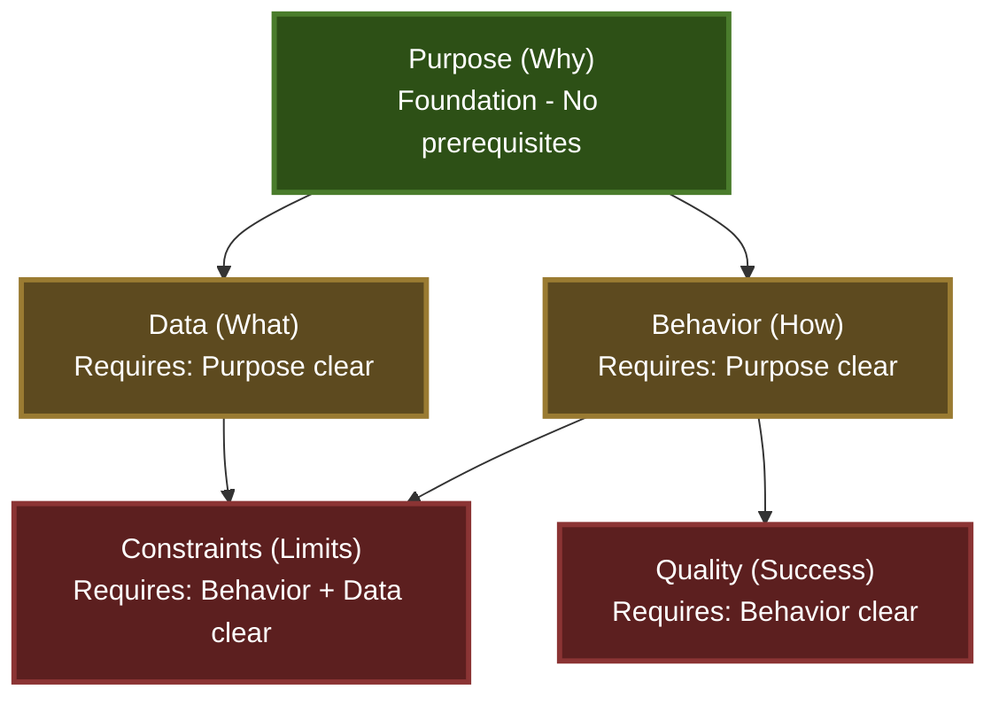

# Good Question

**When you can't articulate your requirements, let me ask the right questions.**

This command uses an information-theoretic approach to extract requirements by reducing uncertainty (entropy) through adaptive questioning.

---

## Core Principle: Entropy Reduction

Your requirements exist in an uncertain state. Each question aims to maximize information gain, systematically reducing entropy until clarity emerges.

```
Initial State: H(Requirements) = High (Maximum Uncertainty)
↓ Question 1 (Max Info Gain)
State After Q1: H(Requirements|A1) = Reduced
↓ Question 2 (Max Remaining Info Gain)
State After Q2: H(Requirements|A1,A2) = Further Reduced
↓ ...
Terminal State: H(Requirements|All Answers) < Threshold (Sufficient Clarity)
```

---

## Uncertainty Dimensions

Track implicit uncertainty across five key dimensions:

### 1. Purpose (Why)
- What problem is being solved?
- Who benefits from this?
- What is the core value?

### 2. Data (What)
- What information is involved?
- What are the inputs and outputs?
- What transformations occur?

### 3. Behavior (How)
- What actions take place?
- What triggers the functionality?
- What is the step-by-step flow?

### 4. Constraints (Limits)
- What technical limitations exist?
- What performance requirements matter?
- What compatibility needs exist?

### 5. Quality (Success)
- How is success measured?
- What edge cases exist?
- What could go wrong?

---

## Dimension Dependencies (DAG Structure)

**CRITICAL: Dimensions have prerequisite relationships. Always check dependencies before selecting the next dimension.**



**Dependency Rules:**

1. **Purpose** (Foundation)
   - No prerequisites
   - Must be addressed first if unclear
   - Gates: Data, Behavior

2. **Data**
   - Prerequisite: Purpose < 0.4 (sufficiently clear)
   - Rationale: Cannot define data requirements without understanding the problem

3. **Behavior**
   - Prerequisite: Purpose < 0.4 (sufficiently clear)
   - Rationale: Cannot define workflow without understanding the goal
   - Gates: Constraints, Quality

4. **Constraints**
   - Prerequisites: Behavior < 0.4 AND Data < 0.4 (both clear)
   - Rationale: Constraints require understanding both what the system does and what data it processes
   - Example: "15fps processing" is meaningless without knowing data volume and format

5. **Quality**
   - Prerequisite: Behavior < 0.4 (sufficiently clear)
   - Rationale: Success criteria primarily depend on expected behavior
   - Data specifics are helpful but not required for defining test scenarios

**Dimension Selection Algorithm:**

```python
# 1. Filter dimensions by prerequisites
def can_ask_dimension(dim, uncertainties):
    prerequisites = {
        "purpose": [],
        "data": ["purpose"],
        "behavior": ["purpose"],
        "constraints": ["behavior", "data"],  # Requires both Behavior and Data
        "quality": ["behavior"]  # Requires only Behavior
    }

    for prereq in prerequisites[dim]:
        if uncertainties[prereq] > 0.4:  # Threshold: >0.4 = unclear
            return False
    return True

# 2. Select highest uncertainty among askable dimensions
askable_dims = {
    dim: unc
    for dim, unc in uncertainties.items()
    if can_ask_dimension(dim, uncertainties)
}

next_dimension = max(askable_dims, key=askable_dims.get)
```

**Example Scenarios:**

```
Scenario 1: Purpose unclear, Behavior has highest uncertainty
uncertainties = {"purpose": 0.7, "data": 0.5, "behavior": 0.8, "constraints": 0.6}

Without DAG: Select "behavior" (highest = 0.8)
With DAG: Select "purpose" (behavior blocked by purpose prerequisite)
```

```
Scenario 2: Purpose clear, Behavior unclear
uncertainties = {"purpose": 0.2, "data": 0.5, "behavior": 0.8, "constraints": 0.6}

Without DAG: Select "behavior" (highest = 0.8)
With DAG: Select "behavior" (prerequisite satisfied ✓)
```

---

## Interview Protocol

### Phase 0: Reference Collection (Optional)

Before beginning the interview, check if the developer has reference materials to save for easy access during the session.

**Ask using AskUserQuestion:**
- Question: "Do you have reference materials to save for this session?"
- Header: "References"
- multiSelect: false
- Options:
  - Label: "Git repository", Description: "Clone a repository to /tmp for reference"
  - Label: "Documentation URL", Description: "Fetch documentation to /tmp"
  - Label: "Local files", Description: "Copy local files to /tmp for reference"
  - Label: "No references", Description: "Continue without saving references"

**If references provided:**
- Git repository: Use Bash tool to `git clone <url> /tmp/ref-<timestamp>-<project>`
- Documentation: Use Bash tool to `curl <url> -o /tmp/ref-<timestamp>-doc.pdf` or `wget <url> -P /tmp/`
- Local files: Use Bash tool to `cp <path> /tmp/ref-<timestamp>-<name>`

**Benefits:**
- References remain accessible throughout the session
- Can be examined later during questioning
- Faster than repeatedly fetching the same resources
- /tmp is automatically cleaned on system restart

**Note:** This phase is optional and can be skipped if the developer has no references or prefers to provide them inline during questioning.

**IMPORTANT: If Phase 0 is executed, record the question immediately after receiving the answer:**

After the user responds to the reference collection question:

1. **Capture the answer** from AskUserQuestion (e.g., "Git repository", "No references")
2. **Prepare answer data**:
   ```bash
   ANSWER="[User's selected option and any details]"
   WORD_COUNT=$(echo "$ANSWER" | wc -w)

   ANSWER_JSON=$(cat <<EOF
   {
     "text": "$ANSWER",
     "word_count": $WORD_COUNT,
     "has_examples": false
   }
   EOF
   )
   ```

3. **Prepare context** (all dimensions start at 1.0 uncertainty):
   ```bash
   CONTEXT_JSON=$(cat <<EOF
   {
     "dimension": "reference_collection",
     "uncertainties_before": {"purpose": 1.0, "data": 1.0, "behavior": 1.0, "constraints": 1.0, "quality": 1.0},
     "uncertainties_after": {"purpose": 1.0, "data": 1.0, "behavior": 1.0, "constraints": 1.0, "quality": 1.0}
   }
   EOF
   )
   ```

4. **Record the question** (runs in background to avoid interrupting the interview):
   ```bash
   export PYTHONPATH="${CLAUDE_PLUGIN_ROOT}" && python3 -m with_me.commands.session record \
     "$SESSION_ID" \
     "Do you have reference materials to save for this session?" \
     "$CONTEXT_JSON" \
     "$ANSWER_JSON"
   ```

   **IMPORTANT**: Use `run_in_background: true` when calling the Bash tool to execute this command. This prevents user confirmation prompts and keeps the interview flow smooth.

**If Phase 0 is skipped**: No recording needed, proceed directly to Phase 1.

---

### Phase 1: Initial Assessment

**Start tracking this question session:**

```bash
export PYTHONPATH="${CLAUDE_PLUGIN_ROOT}"
SESSION_ID=$(python3 -m with_me.commands.session start)
```

Store `SESSION_ID` in a variable for use throughout this session.

---

Begin with an open question to gauge overall clarity:

**Ask using AskUserQuestion:**
- Question: "What do you want to build?"
- Header: "Starting Point"
- multiSelect: false
- Options:
  - Label: "Let me explain", Description: "I'll describe what I have in mind"
  - Label: "Show you examples", Description: "I have references or similar implementations"
  - Label: "Just a goal", Description: "I know what I want to achieve but not how"

**CRITICAL: Record this initial assessment question immediately after receiving the answer**

After the user responds:

1. **Capture the answer** from AskUserQuestion (selected option and any follow-up explanation)
2. **Prepare answer data**:
   ```bash
   ANSWER="[User's selected option and explanation]"
   WORD_COUNT=$(echo "$ANSWER" | wc -w)
   HAS_EXAMPLES=false  # Set to true if user provided examples

   ANSWER_JSON=$(cat <<EOF
   {
     "text": "$ANSWER",
     "word_count": $WORD_COUNT,
     "has_examples": $HAS_EXAMPLES
   }
   EOF
   )
   ```

3. **Assess initial uncertainties** based on the response:
   - "Let me explain" with detailed description → Some dimensions may be clearer
   - "Show you examples" → Need to analyze examples before assessing
   - "Just a goal" → All dimensions remain at high uncertainty

4. **Prepare context** with estimated uncertainties:
   ```bash
   # Example: User gave detailed explanation
   CONTEXT_JSON=$(cat <<EOF
   {
     "dimension": "initial_assessment",
     "uncertainties_before": {"purpose": 1.0, "data": 1.0, "behavior": 1.0, "constraints": 1.0, "quality": 1.0},
     "uncertainties_after": {"purpose": 0.6, "data": 0.8, "behavior": 0.7, "constraints": 0.9, "quality": 0.9}
   }
   EOF
   )
   ```

5. **Record the question** (runs in background to avoid interrupting the interview):
   ```bash
   export PYTHONPATH="${CLAUDE_PLUGIN_ROOT}" && python3 -m with_me.commands.session record \
     "$SESSION_ID" \
     "What do you want to build?" \
     "$CONTEXT_JSON" \
     "$ANSWER_JSON"
   ```

   **IMPORTANT**: Use `run_in_background: true` when calling the Bash tool to execute this command. This prevents user confirmation prompts and keeps the interview flow smooth.

**Based on response:**
- Detailed explanation → Assess which dimensions are clear vs uncertain
- Examples provided → Use Read/Grep/WebFetch to understand, then assess gaps
- Just a goal → Start with Purpose dimension (highest uncertainty)

---

### Phase 2: Structured Questioning

**Three-stage approach to ensure completeness and detect contradictions:**

1. **Phase 2-1: Initial Survey** - Ask each dimension once (guarantees completeness)
2. **Phase 2-2: DAG-based Deep Dive** - Follow DAG order for efficient clarification
3. **Phase 2-3: Contradiction Resolution** - Resolve any detected inconsistencies

---

#### Phase 2-1: Initial Survey (Completeness Guarantee)

**Goal:** Ensure all dimensions are addressed at least once, preventing `answered: false` (uncertainty = 1.0) from remaining.

**Process:**

Ask **one lightweight question** for each dimension in this fixed order:
1. Purpose
2. Data
3. Behavior
4. Constraints
5. Quality

**IMPORTANT:**
- Ask **brief, open-ended questions** to get initial context
- Do NOT deep-dive yet - save detailed follow-ups for Phase 2-2
- Even if user says "not sure", mark dimension as `answered: true` with high uncertainty
- Goal: All dimensions reach `answered: true`, uncertainties typically 0.5-0.8

**CRITICAL: Record each question immediately after receiving the answer**

After asking each dimension question:

1. **Capture the answer** from AskUserQuestion or direct user input
2. **Prepare answer data**:
   ```bash
   ANSWER_JSON=$(cat <<EOF
   {
     "text": "$ANSWER",
     "word_count": $(echo "$ANSWER" | wc -w),
     "has_examples": false
   }
   EOF
   )
   ```

3. **Prepare context** (uncertainties before and after this question):
   ```bash
   CONTEXT_JSON=$(cat <<EOF
   {
     "dimension": "purpose",
     "uncertainties_before": {"purpose": 1.0, ...},
     "uncertainties_after": {"purpose": 0.6, ...}
   }
   EOF
   )
   ```

4. **Record the question** (runs in background to avoid interrupting the interview):
   ```bash
   export PYTHONPATH="${CLAUDE_PLUGIN_ROOT}" && python3 -m with_me.commands.session record \
     "$SESSION_ID" \
     "$QUESTION_TEXT" \
     "$CONTEXT_JSON" \
     "$ANSWER_JSON"
   ```

   **IMPORTANT**: Use `run_in_background: true` when calling the Bash tool to execute this command. This prevents user confirmation prompts and keeps the interview flow smooth.

**Repeat for all 5 dimensions in Phase 2-1.**

**After Initial Survey:**
```bash
# All dimensions now have answered: true
# Calculate uncertainties (will be 0.5-0.8 range typically)
UNCERTAINTIES=$(export PYTHONPATH="${CLAUDE_PLUGIN_ROOT}" && python3 -m with_me.commands.uncertainty --json-only "$DIMENSION_DATA_JSON")
```

Expected result:
```json
{
  "purpose": 0.6,    // answered: true, brief response
  "data": 0.8,       // answered: true, user said "not sure"
  "behavior": 0.7,   // answered: true, partial explanation
  "constraints": 0.5,
  "quality": 0.7
}
```

All dimensions are now in the system. None will remain at 1.0.

---

#### Phase 2-2: DAG-based Deep Dive (Efficient Clarification)

**Goal:** Reduce uncertainties below threshold (< 0.3) following logical DAG order.

**Process:**

At each iteration:
1. **Calculate current uncertainties** (with English translation)
2. **Apply DAG filter** to identify askable dimensions
3. **Select highest uncertainty** among askable dimensions
4. **Ask detailed, targeted questions** for that dimension
5. **IMMEDIATELY record the question** (see recording template below)
6. **Detect cross-dimension contradictions** (see below)

**CRITICAL: Recording Template for Every Question**

After asking ANY question in Phase 2-2, immediately record it:

```bash
# 1. Capture answer from AskUserQuestion or direct input
ANSWER="[User's answer]"

# 2. Calculate word count and detect examples
WORD_COUNT=$(echo "$ANSWER" | wc -w)
HAS_EXAMPLES=false  # Set to true if answer contains concrete examples

# 3. Prepare answer JSON
ANSWER_JSON=$(cat <<EOF
{
  "text": "$ANSWER",
  "word_count": $WORD_COUNT,
  "has_examples": $HAS_EXAMPLES
}
EOF
)

# 4. Prepare context with before/after uncertainties
CONTEXT_JSON=$(cat <<EOF
{
  "dimension": "$DIMENSION",
  "uncertainties_before": $UNCERTAINTIES_BEFORE,
  "uncertainties_after": $UNCERTAINTIES_AFTER
}
EOF
)

# 5. Record the question
export PYTHONPATH="${CLAUDE_PLUGIN_ROOT}" && python3 -m with_me.commands.session record \
  "$SESSION_ID" \
  "$QUESTION_TEXT" \
  "$CONTEXT_JSON" \
  "$ANSWER_JSON"
```

**IMPORTANT**: Use `run_in_background: true` when calling the Bash tool to execute this command. This prevents user confirmation prompts and keeps the interview flow smooth.

**This recording step is MANDATORY for every question, including:**
- AskUserQuestion selections
- Direct text input questions
- Follow-up clarifications
- Validation questions

**Question templates below are organized by dimension. Use these for deep-dive questions.**

#### If Purpose has highest uncertainty:

**Ask using AskUserQuestion:**
- Question: "What problem does this solve?"
- Header: "Purpose"
- multiSelect: false
- Options:
  - Label: "Describe the problem", Description: "Let me explain the problem I'm trying to solve"
  - Label: "User needs", Description: "There's a specific user need or pain point"
  - Label: "Technical requirement", Description: "This is needed for technical reasons"

**CRITICAL: After receiving the user's selection, ask follow-up questions to get detailed explanation:**

Based on their selection, ask appropriate follow-up questions:
- "Who experiences this problem?"
- "What happens if this isn't built?"
- "What does success look like from the user's perspective?"

**Wait for the user's detailed explanation before proceeding to record and move to the next dimension.**

#### If Data has highest uncertainty:

**Ask using AskUserQuestion:**
- Question: "What data is involved?"
- Header: "Data"
- multiSelect: false
- Options:
  - Label: "Describe the data", Description: "Let me explain the data structure and flow"
  - Label: "Show examples", Description: "I have sample data or schemas"
  - Label: "Not sure yet", Description: "I haven't thought about the data structure"

**CRITICAL: After receiving the user's selection, ask follow-up questions to get detailed explanation:**

Based on their selection, ask appropriate follow-up questions:
- "What triggers data to enter the system?"
- "What format is the data in?"
- "What information must be preserved vs transformed?"

**Wait for the user's detailed explanation before proceeding to record and move to the next dimension.**

#### If Behavior has highest uncertainty:

**Ask using AskUserQuestion:**
- Question: "What should happen step by step?"
- Header: "Behavior"
- multiSelect: false
- Options:
  - Label: "Walk through it", Description: "Let me describe the flow step by step"
  - Label: "Similar to existing", Description: "It works like [reference] but with differences"
  - Label: "Uncertain", Description: "I'm not sure about the exact flow"

**CRITICAL: After receiving the user's selection, ask follow-up questions to get detailed explanation:**

Based on their selection, ask appropriate follow-up questions:
- "What initiates this process?"
- "What are the critical decision points?"
- "When does the process complete?"

**Wait for the user's detailed explanation before proceeding to record and move to the next dimension.**

#### If Constraints have highest uncertainty:

**Ask using AskUserQuestion:**
- Question: "Any constraints I should know about?"
- Header: "Constraints"
- multiSelect: true
- Options:
  - Label: "Performance critical", Description: "Speed, memory, or latency requirements"
  - Label: "Security sensitive", Description: "Authentication, authorization, or data protection"
  - Label: "Compatibility needs", Description: "Must work with specific versions or systems"
  - Label: "No specific constraints", Description: "Standard practices are fine"

**CRITICAL: After receiving the user's selection(s), ask follow-up questions for each selected constraint:**

For each selected constraint, drill deeper:
- Performance: "What are the acceptable thresholds?"
- Security: "What are the threat scenarios?"
- Compatibility: "What must be supported?"

**Wait for the user's detailed explanation before proceeding to record and move to the next dimension.**

#### If Quality has highest uncertainty:

**Ask using AskUserQuestion:**
- Question: "How do you know it works correctly?"
- Header: "Quality"
- multiSelect: false
- Options:
  - Label: "Describe test cases", Description: "I can explain what scenarios to test"
  - Label: "Follow standards", Description: "Apply standard testing practices"
  - Label: "Not sure", Description: "I need help defining success criteria"

**CRITICAL: After receiving the user's selection, ask follow-up questions to get detailed explanation:**

Based on their selection, ask appropriate follow-up questions:
- "What are the critical success scenarios?"
- "What edge cases concern you?"
- "What failure modes should be handled?"

**Wait for the user's detailed explanation before proceeding to record and move to the next dimension.**

---

**Cross-Dimension Contradiction Detection:**

After each answer in Phase 2-2, review prerequisite dimensions for semantic contradictions.

**Common contradiction types:**
- Purpose-Data: Target users don't match data scale (e.g., "individual streamers" + "enterprise database")
- Purpose-Behavior: Complexity mismatch (e.g., "simple tool" + "complex multi-stage workflow")
- Behavior-Constraints: Processing type conflict (e.g., "real-time" + "batch processing")
- Data-Constraints: Format incompatibility (e.g., "video files" + "text-only environment")

**When contradictions detected:**
1. Notify user with specific conflicting statements
2. Ask user to clarify using AskUserQuestion with options: which is correct, both need update, or nuance explanation
3. Update affected dimension data and recalculate uncertainties

---

### Phase 2.5: Question Quality Evaluation (Optional but Recommended)

**Before asking a question, evaluate its expected effectiveness:**

```bash
REWARD=$(export PYTHONPATH="${CLAUDE_PLUGIN_ROOT}" && python3 -m with_me.lib.question_reward_calculator \
  "$QUESTION_TEXT" \
  "$CONTEXT_JSON")
```

Where `CONTEXT_JSON` contains:
```json
{
  "uncertainties": {"purpose": 0.9, "data": 0.7, ...},
  "answered_dimensions": ["purpose"],
  "question_history": ["What problem does this solve?", ...]
}
```

**Interpret reward score:**

```json
{
  "total_reward": 0.75,
  "components": {
    "info_gain": 0.80,
    "clarity": 0.85,
    "specificity": 0.60,
    "actionability": 0.75,
    "relevance": 0.90
  },
  "kl_divergence": 0.15
}
```

**Quality thresholds:**
- `total_reward > 0.7`: High-quality question, proceed
- `0.5 < total_reward ≤ 0.7`: Acceptable, but consider refinement
- `total_reward ≤ 0.5`: Low quality, rephrase for better effectiveness

**Component interpretation:**
- **Low info_gain** (<0.5): Target dimension already well-understood, choose different dimension
- **Low clarity** (<0.6): Question is too complex or compound, simplify
- **Low specificity** (<0.5): Question is too vague, add concrete examples or constraints
- **Low actionability** (<0.5): Question may be too technical or premature, adjust level
- **Low relevance** (<0.5): Question doesn't address high-uncertainty areas, refocus

**If total_reward is low, refine the question:**
1. Identify the weakest component
2. Adjust question to improve that aspect
3. Re-evaluate reward score
4. Proceed when total_reward > 0.7 or after 2 refinement attempts

---

#### Phase 2-3: Contradiction Resolution

**Goal:** Resolve any unresolved contradictions before proceeding to validation.

**If contradictions remain unresolved:**

1. **List all unresolved contradictions** to user
2. **For each contradiction**, ask user to choose:
   - Which dimension is correct?
   - Should both be updated?
   - Is there context that makes both valid?

3. **Update dimension data** based on resolution
4. **Recalculate uncertainties** for updated dimensions

**If no contradictions:**
- Proceed directly to Phase 3

**Phase 2-2 Exit Criteria:**

Proceed to Phase 2-3 (or Phase 3 if no contradictions) when:
- All dimensions `answered: true` (guaranteed by Phase 2-1)
- AND all dimensions < 0.3 threshold
- OR stuck dimension detected (same uncertainty after 3+ questions)

---

### Recording Checklist (Quality Assurance)

**Before proceeding to Phase 3, verify that ALL questions were recorded:**

- [ ] Counted total questions asked (AskUserQuestion + direct input)
- [ ] Verified each question was followed by `record` command
- [ ] Checked `question_feedback.json` has matching number of entries
- [ ] All recorded questions have `reward_scores` calculated
- [ ] All recorded questions have `uncertainties_before` and `uncertainties_after`

**If recording was missed:**

Questions without proper recording will NOT contribute to:
- Question quality improvement
- `/with-me:stats` analytics
- Entropy maximization learning
- Best question pattern discovery

**Recovery procedure** (if recordings were missed):
1. Review conversation history
2. Identify all questions and answers
3. Use `record-batch` command to record missed questions
4. Verify recordings before completing session

**Why this matters:**
- Machine learning feedback loop depends on complete data
- Incomplete recordings bias statistics toward recorded questions only
- Pattern recognition requires full question coverage

---

### Phase 3: Convergence Detection

After each answer, assess:

**CRITICAL: Before calculating uncertainty, translate content to English**

The uncertainty calculator uses word count analysis, which only works correctly with English text. Before calling the uncertainty calculator:

1. **Translate all `content` fields to English**
   - Detect if content is non-English (Japanese, etc.)
   - If non-English: Translate to English while preserving technical terms
   - If already English: Use as-is
   - This ensures consistent word count calculation across languages

Example:
```python
# Before (Japanese content - word count = 1)
"content": "機微情報漏洩防止、配信者一般向け、リスクと価値提案が明確"

# After translation (English content - word count = 12)
"content": "Prevent sensitive information leakage, for general streamers, risks and value proposition are clear"
```

**Then perform uncertainty assessment and record the question:**

1. **Calculate uncertainty scores** (with translated English content):
   ```bash
   UNCERTAINTIES=$(export PYTHONPATH="${CLAUDE_PLUGIN_ROOT}" && python3 -m with_me.commands.uncertainty --json-only "$DIMENSION_DATA_JSON")
   ```

   Where `DIMENSION_DATA_JSON` contains all dimension data with translated English content:
   ```json
   {
     "purpose": {"answered": true, "content": "Translated English text...", "examples": 2, "contradictions": false},
     "data": {"answered": true, "content": "Translated English text...", "examples": 1, "contradictions": false},
     ...
   }
   ```

   The script outputs uncertainty scores and recommendations:
   ```json
   {
     "uncertainties": {"purpose": 0.2, "data": 0.5, ...},
     "continue_questioning": true,
     "next_focus": "data"
   }
   ```

2. **Record this question-answer pair** (runs in background to avoid interrupting the interview):
   ```bash
   export PYTHONPATH="${CLAUDE_PLUGIN_ROOT}" && python3 -m with_me.commands.session record \
     "$SESSION_ID" \
     "$QUESTION_TEXT" \
     "$CONTEXT_JSON" \
     "$ANSWER_JSON"
   ```

   **IMPORTANT**: Use `run_in_background: true` when calling the Bash tool to execute this command. This prevents user confirmation prompts and keeps the interview flow smooth.

   Where:
   - `CONTEXT_JSON`: `{"dimension": "...", "uncertainties_before": {...}, "uncertainties_after": {...}}`
   - `ANSWER_JSON`: `{"text": "...", "word_count": N, "has_examples": true/false}`

3. **Assess progress using uncertainty scores and DAG dependencies:**

   Use the DAG-aware dimension selection algorithm (see "Dimension Dependencies" section above) to identify the next focus dimension.

   **Determine questioning strategy based on uncertainty level:**

   - **High uncertainty (> 0.6)**: Ask broad exploratory questions
     - Example: "What problem does this solve?" (Purpose)
     - Goal: Gather foundational understanding

   - **Medium uncertainty (0.3 - 0.6)**: Ask specific clarification questions
     - Example: "What are the specific data inputs required?" (Data)
     - Goal: Fill remaining gaps with targeted questions

   - **Low uncertainty (< 0.3)**: Validate understanding or move to next dimension
     - Example: "To confirm, the data flow is X→Y→Z, correct?" (Validation)
     - Goal: Confirm completeness before proceeding

   **Decision flow:**
   1. If next_uncertainty > 0.3 → Continue questioning on that dimension
   2. If all uncertainties < 0.3 → Proceed to validation phase
   3. If stuck (no uncertainty reduction after 2 questions) → Rephrase or change approach

---

### Phase 4: Validation & Gap Analysis

**Validation Readiness Criteria:**
- All dimensions have `answered: true` (from Phase 2-1)
- AND all dimensions < 0.30 (from Phase 2-2)
- Average uncertainty < 0.25 (overall clarity achieved)

**Continue questioning if:**
- Any dimension still has `answered: false` (should not happen after Phase 2-1)
- OR any dimension ≥ 0.30 (needs more clarification)
- OR average uncertainty ≥ 0.25 (more work needed)

**Edge case - stuck dimension:**
If a dimension remains > 0.30 after 3+ questions:
- User may genuinely not know the answer
- Acknowledge the uncertainty in the specification
- Proceed to validation with documented assumptions

---

When ready for validation:

**Summarize your understanding:**
```markdown
## My Understanding

### Purpose
[What problem this solves and for whom]

### Data
[Input/output/transformations]

### Behavior
[Step-by-step flow]

### Constraints
[Technical limitations and requirements]

### Quality
[Success criteria and edge cases]
```

**Then ask using AskUserQuestion:**
- Question: "Does this capture your requirements correctly?"
- Header: "Validation"
- multiSelect: false
- Options:
  - Label: "Yes, accurate", Description: "This correctly represents what I want"
  - Label: "Needs refinement", Description: "Close, but some aspects need adjustment"
  - Label: "Missing key aspects", Description: "There are important parts not covered"

If refinement needed, identify remaining gaps and ask targeted follow-ups.

---

### Phase 4.5: Pre-Completion Recording Verification

**Before completing the session, verify recording completeness:**

```bash
# Count recorded questions in current session
RECORDED_COUNT=$(export PYTHONPATH="${CLAUDE_PLUGIN_ROOT}" && python3 -m with_me.commands.session_question_count "$SESSION_ID")

echo "Questions recorded in this session: $RECORDED_COUNT"
```

**Compare with actual questions asked:**

Count all questions you asked:
- Phase 0: Reference collection question (1 question, only if Phase 0 was executed)
- Phase 1: Initial assessment question (1 question)
- Phase 2-1: 5 dimension survey questions (exactly 5 questions)
- Phase 2-2: Deep-dive questions (varies, typically 2-10 questions)
- Phase 2-3: Contradiction resolution questions (if any, typically 0-3 questions)
- Phase 3: Convergence validation questions (if any, typically 0-2 questions)
- Phase 4: Final validation question (1 question)

**Expected total:**
- Minimum: 8 questions (if Phase 0 skipped, no Phase 2-3, no Phase 3 follow-ups)
- Typical: 10-15 questions
- Maximum: 20+ questions (complex requirements with many clarifications)

**If counts don't match:**

1. **Identify missing questions** by reviewing conversation history
2. **Prepare batch recording data** (if more than 2 questions missed):
   ```bash
   BATCH_JSON=$(cat <<EOF
   [
     {
       "question": "What problem does this solve?",
       "dimension": "purpose",
       "context": {
         "dimension": "purpose",
         "uncertainties_before": {"purpose": 1.0},
         "uncertainties_after": {"purpose": 0.3}
       },
       "answer": {
         "text": "User's answer here",
         "word_count": 45,
         "has_examples": true
       }
     }
   ]
   EOF
   )

   export PYTHONPATH="${CLAUDE_PLUGIN_ROOT}" && python3 -m with_me.commands.session record-batch \
     "$SESSION_ID" \
     "$BATCH_JSON"
   ```

   **IMPORTANT**: Use `run_in_background: true` when calling the Bash tool to execute this command. This prevents user confirmation prompts and keeps the interview flow smooth.

3. **Or record individually** (if only 1-2 questions missed):
   Use the standard `record` command for each missed question

**Verification:**
```bash
# Re-check count after recovery
FINAL_COUNT=$(export PYTHONPATH="${CLAUDE_PLUGIN_ROOT}" && python3 -m with_me.commands.session_question_count "$SESSION_ID")

echo "Final recorded count: $FINAL_COUNT"
```

**Proceed to Phase 5 only when:**
- Recorded count matches actual questions asked
- OR missing questions have been recovered via batch recording
- OR you acknowledge incomplete data and document it in session notes

---

### Phase 5: Analysis (Forked Context)

Once all dimensions are sufficiently clear and validated:

**Complete the question session tracking:**

```bash
export PYTHONPATH="${CLAUDE_PLUGIN_ROOT}" && python3 -m with_me.commands.session complete \
  "$SESSION_ID" \
  "$FINAL_UNCERTAINTIES_JSON"
```

Where `FINAL_UNCERTAINTIES_JSON` contains the final uncertainty scores for all dimensions:
```json
{"purpose": 0.2, "data": 0.3, "behavior": 0.25, "constraints": 0.15, "quality": 0.28}
```

This generates session statistics for the `/with-me:stats` command.

---

**Prepare dimension data for requirement-analysis skill:**

The `requirement-analysis` skill requires dimension data in a specific JSON format. You need to prepare this data from the collected information during the interview.

**Step 1: Compile dimension data JSON**

For each dimension, summarize what was learned:

```bash
DIMENSION_DATA_JSON=$(cat <<'EOF'
{
  "purpose": {
    "answered": true,
    "content": "Summary of purpose answers in English",
    "examples": 2,
    "contradictions": false
  },
  "data": {
    "answered": true,
    "content": "Summary of data answers in English",
    "examples": 1,
    "contradictions": false
  },
  "behavior": {
    "answered": true,
    "content": "Summary of behavior answers in English",
    "examples": 3,
    "contradictions": false
  },
  "constraints": {
    "answered": true,
    "content": "Summary of constraints answers in English",
    "examples": 1,
    "contradictions": false
  },
  "quality": {
    "answered": true,
    "content": "Summary of quality answers in English",
    "examples": 0,
    "contradictions": false
  }
}
EOF
)
```

**CRITICAL: Content must be in English**
- The uncertainty calculator uses word count analysis, which only works correctly with English text
- If answers were collected in other languages, translate the content summaries to English
- Keep technical terms in their original form

**Step 2: Verify uncertainty calculation**

Before invoking the skill, verify that all dimensions meet the threshold:

```bash
export PYTHONPATH="${CLAUDE_PLUGIN_ROOT}"
UNCERTAINTIES=$(python3 -m with_me.commands.uncertainty --json-only "$DIMENSION_DATA_JSON")

echo "Final uncertainties: $UNCERTAINTIES"
```

Expected output:
```json
{
  "uncertainties": {"purpose": 0.2, "data": 0.25, "behavior": 0.15, "constraints": 0.1, "quality": 0.2},
  "continue_questioning": false,
  "next_focus": null
}
```

If `continue_questioning: true`, do NOT proceed to requirement-analysis yet. Return to Phase 2-2 for additional questioning.

**Step 3: Invoke the requirement-analysis skill**

The `requirement-analysis` skill uses `context: fork`, which automatically runs in an isolated sub-agent context, keeping the main session clean.

Pass the dimension data JSON to the skill:

```
Use the requirement-analysis skill to analyze the gathered requirements.

Dimension data (JSON format):
```json
{JSON content from DIMENSION_DATA_JSON}
```

The skill will:
1. Calculate final uncertainty scores
2. Generate structured requirement specification if uncertainty is low enough
3. Identify any remaining ambiguities or contradictions
4. Provide implementation approach suggestions
5. Assess risks and challenges
```

The skill automatically runs in a forked context, so the analysis won't pollute the main conversation.

**Important notes:**
- The skill reads dimension data from your prompt, NOT from session files
- Ensure dimension summaries are comprehensive and in English
- All collected examples and context should be included in the content field

---

## Questioning Heuristics

### Information Gain Prioritization

Choose questions that maximize expected information gain:

**High Gain Questions:**
- Open-ended: "Describe..." "Explain..." "Walk me through..."
- Reveal unknowns: "What haven't we discussed?"
- Expose conflicts: "How does X relate to Y?"

**Medium Gain Questions:**
- Binary choices: "Is this performance-critical?"
- Categorical: "Which type of feature is this?"

**Low Gain Questions:**
- Confirmations: "Is this correct?"
- Already-implied information

### Numerical Guidance Integration

**Use uncertainty scores and reward metrics to guide decisions:**

**Uncertainty-driven selection:**
```python
# Always target the dimension with highest uncertainty
next_dim = max(uncertainties, key=uncertainties.get)
```

**Reward-driven refinement:**
- Generate initial question
- Calculate reward score
- If total_reward < 0.7: Refine based on weakest component
- Repeat until total_reward ≥ 0.7 or 2 attempts made

**Progress tracking:**
```python
# Track uncertainty reduction
info_gain = uncertainty_before - uncertainty_after

# If info_gain < 0.1 after 2 questions on same dimension:
#   → Question approach not working, try different angle
#   → Or dimension may be inherently unclear to user
```

**Statistical learning:**
- Consult `/with-me:stats` for best-performing question patterns
- Use historical avg_questions_per_dimension to estimate remaining effort
- Avoid question patterns with low historical reward

### Adaptive Depth

- **High uncertainty (> 0.6)** → Broad exploratory questions
- **Medium uncertainty (0.3 - 0.6)** → Targeted clarification questions
- **Low uncertainty (< 0.3)** → Validation questions

### Branching Logic

Based on answer patterns:
- Vague answers → Increase question specificity
- Detailed answers → Extract implied constraints and assumptions
- Contradictory answers → Resolve conflicts immediately
- Confident answers → Validate with edge cases

---

## Interviewing Principles

### Do:
- Ask questions that reduce the most uncertainty
- Drill deeper when answers are vague or reveal new uncertainty
- Validate understanding before moving to next dimension
- Use Read/Grep/WebFetch when references are provided
- Adjust questioning based on developer's communication style
- Summarize and confirm understanding regularly

### Don't:
- Ask questions about dimensions that are already clear
- Accept ambiguity when clarification would significantly reduce uncertainty
- Make assumptions without validation
- Continue questioning past the point of diminishing returns
- Skip validation even if you think you understand

---

## Terminal Conditions

End the interview when:

1. **Sufficient Clarity:** All dimensions below uncertainty threshold
2. **Diminishing Returns:** No available question would significantly reduce remaining uncertainty
3. **Implementation Ready:** You have enough context to proceed confidently
4. **Developer Confirmation:** Developer validates your understanding

Then invoke the `requirement-analysis` skill, which runs in a forked context to generate the formal specification without polluting the main conversation.

---

## Success Criteria

This command succeeds when:
- Uncertainty has been systematically reduced across all dimensions
- No critical ambiguities remain
- Clear implementation path is identified
- Developer feels understood and requirements are captured
- The resulting specification enables confident implementation

**The developer should think "good question" after each question** - meaning the questions surface aspects they hadn't articulated or help them clarify what they couldn't express.
