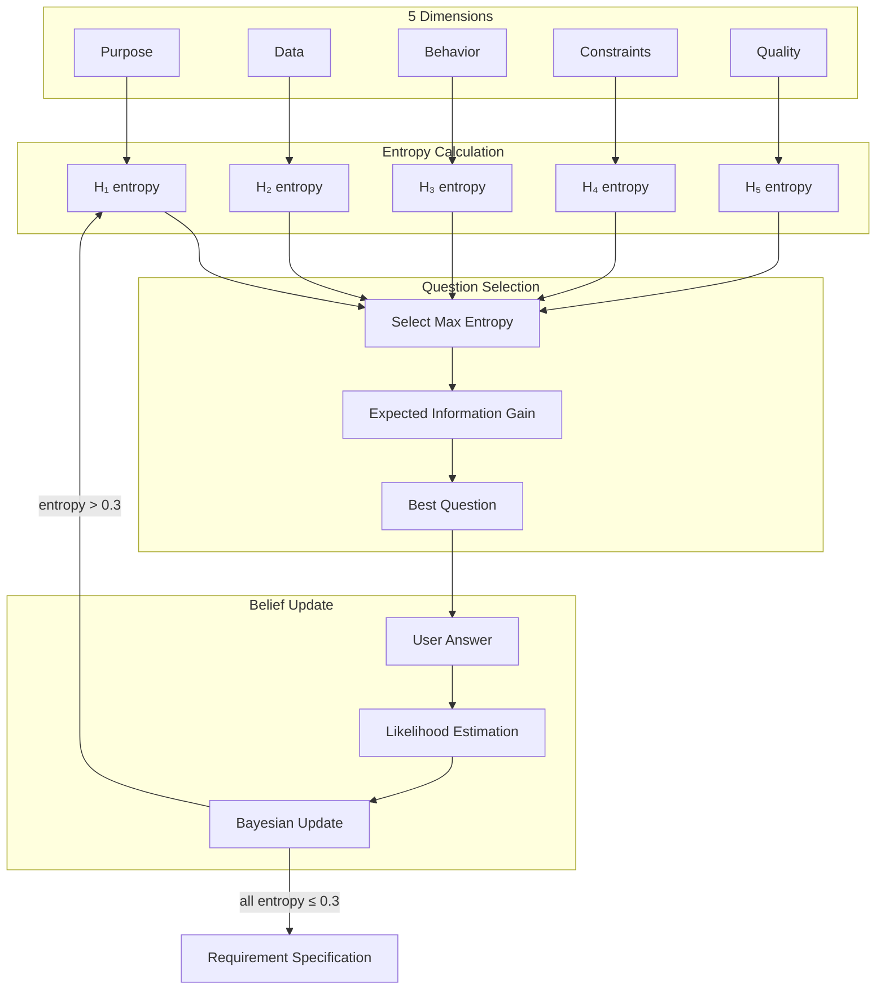

# With Me - Technical Documentation

This document provides detailed technical information about the With Me plugin's architecture, algorithms, configuration, and design principles.

---

## Table of Contents

- [Architecture](#architecture)
- [Information-Theoretic Foundation](#information-theoretic-foundation)
- [Configuration and Thresholds](#configuration-and-thresholds)
- [Available Commands](#available-commands)
- [Available Skills](#available-skills)

---

## Architecture

### Claude Computational Engine Architecture

The with-me plugin implements a **hybrid computational architecture** where:
- **Python handles I/O**: Session management, data persistence, CLI interface
- **Claude performs computations**: All mathematical algorithms executed via skills

**Architecture Benefits:**
- **Distributable Intelligence**: Skills are portable markdown files, not compiled code
- **Transparent Computation**: All calculations visible in Claude's reasoning
- **Zero External Dependencies**: No NumPy, SciPy, or ML libraries required
- **Skill Composition**: Skills can invoke other skills for complex workflows

### Stateful Session Design

This plugin uses **persistent session state** rather than stateless API calls. This design choice is intentional for Claude Code's long-running interactive sessions:

1. **Progressive Accumulation**: Each question builds on previous answers, requiring full conversation history
2. **Session Resumption**: Users can pause and resume requirement elicitation across multiple Claude Code sessions
3. **Token Efficiency**: Avoids re-transmitting entire belief state on every API call (CLI stores session state locally)
4. **Audit Trail**: Complete question history preserved for requirement specification generation and debugging
5. **Convergence Detection**: Tracks entropy trends over time to detect when sufficient clarity is achieved

**Session state includes:**
- **Beliefs**: Posterior probability distributions over all hypotheses (Bayesian-updated after each answer)
- **Question History**: All questions, answers, and information gain metrics
- **Metadata**: Session ID, question count, convergence status

This stateful design is optimized for Claude Code's use case (interactive requirement elicitation) rather than ephemeral API calls or microservices.

---

## Information-Theoretic Foundation

### Uncertainty Convergence Process



This is not a chatbot—it's a convergence engine based on information theory.

The system uses Bayesian belief updating and information theory for adaptive questioning:

### Reward Function

$$r(Q) = \text{EIG}(Q) + 0.1 \cdot \text{clarity}(Q) + 0.05 \cdot \text{importance}(Q)$$

### Key Concepts

#### Shannon Entropy

Measures uncertainty in bits:

$$H(X) = -\sum_{i} p(x_i) \log_2 p(x_i)$$

- $H = 0$: complete certainty (one hypothesis has probability 1)
- $H = \log_2 N$: maximum uncertainty (uniform distribution over N hypotheses)

#### Bayesian Update

Updates beliefs based on new evidence:

$$p(h | e) = \frac{p(e | h) \cdot p(h)}{\sum_{h'} p(e | h') \cdot p(h')}$$

where $p(e | h)$ is the likelihood of observing answer $e$ given hypothesis $h$.

#### Expected Information Gain (EIG)

Predicts uncertainty reduction through counterfactual simulation:

$$\text{EIG}(Q) = H(X) - \mathbb{E}_{a \sim p(a|Q)}[H(X | a)]$$

The question $Q^*$ that maximizes EIG is selected:

$$Q^* = \arg\max_Q \text{EIG}(Q)$$

#### Information Gain

Quantifies learning from each answer:

$$\text{IG} = H_{\text{before}} - H_{\text{after}}$$

This architecture enables continuous improvement through statistical analysis of question effectiveness across sessions.

---

## Configuration and Thresholds

The system uses several configurable thresholds in `config/dimensions.json`:

### Convergence Threshold (default: 0.3)

**What it means**: Entropy value below which a dimension is considered "resolved"

- **Entropy scale**: 0.0 (complete certainty) to log₂(N) bits (maximum uncertainty, where N = number of hypotheses)
- **Example**: For 4 hypotheses, max entropy = 2.0 bits
  - Entropy 0.3 → ~85% confidence in one hypothesis
  - Entropy 1.0 → ~50% confidence spread across 2-3 hypotheses
  - Entropy 2.0 → uniform distribution (complete uncertainty)

**When to adjust**:
- **Lower (e.g., 0.2)**: Need higher confidence before moving on (more questions, longer sessions)
- **Higher (e.g., 0.5)**: Accept moderate confidence (fewer questions, faster sessions)

### Prerequisite Threshold (default: 1.5)

**What it means**: Maximum entropy allowed in prerequisite dimension before unblocking dependent dimensions

- **Purpose**: Ensures foundational dimensions (e.g., "Purpose") are clarified before advanced ones (e.g., "Performance")

**When to adjust**:
- **Lower (e.g., 1.0)**: Require stronger clarity in prerequisites
- **Higher (e.g., 2.0)**: Allow parallel exploration of dimensions with less strict ordering

### Question Limits

- `max_questions` (default: 50): Safety limit to prevent infinite loops
- `min_questions` (default: 5): Minimum questions before allowing early termination

### Likelihood Validation

The system validates all LLM-generated likelihood values to ensure numerical stability:

- **Epsilon** (1e-9): Minimum non-zero likelihood value (prevents log(0) errors)
- **Normalization**: All likelihoods automatically normalized to sum=1.0
- **Negative Clamping**: Negative values clamped to 0.0
- **Uniform Fallback**: If all likelihoods are zero, falls back to uniform distribution

> **Implementation**: See `with_me.lib.dimension_belief` and `with_me.lib.session_orchestrator` modules for likelihood validation and normalization logic.

**Adjust thresholds based on**:
- **Domain complexity**: More complex domains may need lower convergence thresholds
- **Time constraints**: Tighter schedules may warrant higher thresholds
- **User patience**: Longer sessions require user engagement tolerance
- **Requirement criticality**: Safety-critical systems need lower thresholds (higher confidence)

---

## Available Commands

### `/with-me:good-question` - Adaptive Requirement Elicitation

When you can't articulate your requirements, this command uses an information theory-inspired approach to systematically reduce uncertainty through adaptive questioning.

**How it works:**

The command tracks uncertainty across five key dimensions:
1. **Purpose (Why)**: What problem is being solved and for whom
2. **Data (What)**: Inputs, outputs, transformations
3. **Behavior (How)**: Step-by-step flow and interactions
4. **Constraints (Limits)**: Technical requirements and limitations
5. **Quality (Success)**: Test scenarios and success criteria

At each step, Claude identifies the dimension with highest remaining uncertainty and asks questions that maximize information gain. The interview adapts dynamically based on your answers.

**Usage:**
```bash
/with-me:good-question
```

**Process:**
1. **Initial Assessment** - Claude gauges your overall clarity
2. **Adaptive Questioning** - Questions target the most uncertain aspects
3. **Convergence Detection** - Claude recognizes when clarity is sufficient
4. **Validation** - Your understanding is summarized and confirmed
5. **Analysis** - Structured specification generated via `requirement-analysis` skill

---

## Available Skills

### Specification Generation Skill

**`/with-me:requirement-analysis`** - Structured Requirement Specification

- Transforms interview data into formal specifications
- Uses `context: fork` for isolated sub-agent processing
- Generates comprehensive documentation with acceptance criteria

---

## Five Dimensions Framework

The adaptive questioning process systematically explores five key dimensions:

### 1. Purpose (Why)
- What problem is being solved?
- Who are the users?
- What are the business goals?
- What success looks like?

### 2. Data (What)
- Input data sources and formats
- Output requirements
- Data transformations
- Data validation rules

### 3. Behavior (How)
- Step-by-step workflow
- User interactions
- System responses
- Edge cases and error handling

### 4. Constraints (Limits)
- Performance requirements
- Technical limitations
- Resource constraints
- Compatibility requirements

### 5. Quality (Success)
- Test scenarios
- Acceptance criteria
- Success metrics
- Failure conditions

---

## Contributing

See [CONTRIBUTING.md](../../../CONTRIBUTING.md) for development setup, testing, and contribution guidelines.
