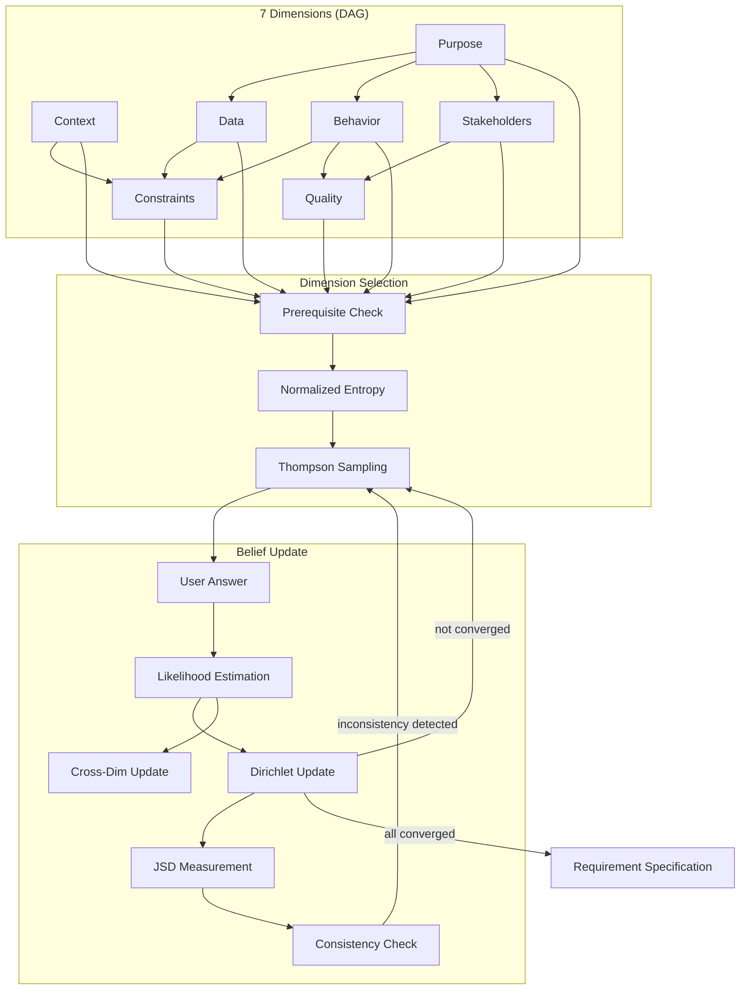

# With Me - Technical Documentation

This document provides detailed technical information about the With Me plugin's architecture, algorithms, configuration, and design principles.

---

## Table of Contents

- [Architecture](#architecture)
- [Information-Theoretic Foundation](#information-theoretic-foundation)
- [Configuration and Thresholds](#configuration-and-thresholds)
- [Available Commands](#available-commands)
- [Available Skills](#available-skills)

---

## Architecture

### Claude Computational Engine Architecture

The with-me plugin implements a **hybrid computational architecture** where:
- **Python handles I/O**: Session management, data persistence, CLI interface
- **Claude performs computations**: All mathematical algorithms executed via skills

**Architecture Benefits:**
- **Distributable Intelligence**: Skills are portable markdown files, not compiled code
- **Transparent Computation**: All calculations visible in Claude's reasoning
- **Zero External Dependencies**: No NumPy, SciPy, or ML libraries required
- **Skill Composition**: Skills can invoke other skills for complex workflows

### Stateful Session Design

This plugin uses **persistent session state** rather than stateless API calls. This design choice is intentional for Claude Code's long-running interactive sessions:

1. **Progressive Accumulation**: Each question builds on previous answers, requiring full conversation history
2. **Session Resumption**: Users can pause and resume requirement elicitation across multiple Claude Code sessions
3. **Token Efficiency**: Avoids re-transmitting entire belief state on every API call (CLI stores session state locally)
4. **Audit Trail**: Complete question history preserved for requirement specification generation and debugging
5. **Convergence Detection**: Tracks entropy trends over time to detect when sufficient clarity is achieved

**Session state includes:**
- **Beliefs**: Dirichlet concentration parameters (alpha) per dimension, from which posterior probabilities are derived as $p(h) = \alpha_h / \sum \alpha$
- **Thompson States**: Beta distribution parameters (alpha, beta) per dimension for exploration-exploitation
- **Question History**: All questions, answers, information gain, and JSD (belief shift) metrics
- **Recent Information Gains**: Sliding window for diminishing returns detection
- **Metadata**: Session ID, question count, convergence status

This stateful design is optimized for Claude Code's use case (interactive requirement elicitation) rather than ephemeral API calls or microservices.

---

## Information-Theoretic Foundation

### Uncertainty Convergence Process



This is not a chatbot—it's a convergence engine based on information theory.

The system uses Dirichlet belief tracking and information theory for adaptive questioning:

### Reward Function

$$r(Q) = \text{EIG}(Q) + 0.1 \cdot \text{clarity}(Q) + 0.05 \cdot \text{importance}(Q)$$

### Key Concepts

#### Shannon Entropy

Measures uncertainty in bits:

$$H(X) = -\sum_{i} p(x_i) \log_2 p(x_i)$$

- $H = 0$: complete certainty (one hypothesis has probability 1)
- $H = \log_2 N$: maximum uncertainty (uniform distribution over N hypotheses)

Entropy is **normalized** by $H_{\max} = \log_2 N$ per dimension so that dimensions with different hypothesis counts are compared on a $[0, 1]$ scale.

#### Dirichlet Belief Tracking

Beliefs are represented as Dirichlet concentration parameters $\boldsymbol{\alpha}$, not point-estimate posteriors. The posterior is derived as:

$$p(h_i) = \frac{\alpha_i}{\sum_j \alpha_j}$$

Updates use an **additive rule** instead of multiplicative Bayes:

$$\alpha_i^{\text{new}} = \alpha_i^{\text{old}} + w \cdot L(h_i)$$

where $L(h_i)$ is the normalized likelihood and $w$ is a weight factor (1.0 for primary, 0.3 for secondary cross-dimension updates).

**Why Dirichlet instead of multiplicative Bayes?** A single observation cannot dramatically shift beliefs. Convergence is gradual and stable, which better models the incremental nature of requirement elicitation.

#### Jensen-Shannon Divergence (JSD)

Measures the shift in beliefs after each answer:

$$\text{JSD}(P \| Q) = H(M) - \frac{1}{2} H(P) - \frac{1}{2} H(Q)$$

where $M = \frac{1}{2}(P + Q)$. Uses $\log_2$, so $\text{JSD} \in [0, 1]$.

JSD is tracked per question to quantify **belief impact** independently of entropy change (information gain).

#### Expected Information Gain (EIG)

Predicts uncertainty reduction through counterfactual simulation:

$$\text{EIG}(Q) = H(X) - \mathbb{E}_{a \sim p(a|Q)}[H(X | a)]$$

The question $Q^*$ that maximizes EIG is selected:

$$Q^* = \arg\max_Q \text{EIG}(Q)$$

#### Thompson Sampling

Dimension selection uses Thompson Sampling for exploration-exploitation balance. Each dimension maintains a Beta distribution $\text{Beta}(\alpha, \beta)$:

- **Informative question** (IG > $\epsilon$): $\alpha \mathrel{+}= 1$ (reward)
- **Uninformative question** (IG $\leq \epsilon$): $\beta \mathrel{+}= 1$ (penalty)

At each step, a sample is drawn from each accessible dimension's Beta distribution, and the dimension with the highest sample is selected. This naturally balances exploiting high-yield dimensions with exploring uncertain ones.

A `deterministic=True` mode preserves the greedy entropy-based selection for testing and backward compatibility.

#### Presheaf Consistency

The dimension DAG is equipped with **restriction maps** — conditional distributions $P(\text{target}_h \mid \text{source}_h)$ for each edge. Given the source dimension's posterior, the expected target posterior is:

$$E[\text{target}_h] = \sum_s p(s) \cdot P(\text{target}_h \mid s)$$

JSD between actual and expected target posteriors measures **belief consistency**. High JSD (above `consistency_threshold`) indicates contradictory answers across dimensions.

#### Cross-Dimension Information Flow

When an answer to one dimension also provides information about other dimensions, **secondary updates** apply a weighted Dirichlet update ($w = 0.3$ by default) to the secondary dimensions. This propagates information across the DAG without requiring separate questions.

#### Information Gain

Quantifies learning from each answer:

$$\text{IG} = H_{\text{before}} - H_{\text{after}}$$

This architecture enables continuous improvement through statistical analysis of question effectiveness across sessions.

---

## Configuration and Thresholds

The system uses several configurable thresholds in `config/dimensions.json`:

### Convergence Threshold (default: 0.3)

**What it means**: Entropy value below which a dimension is considered "resolved"

- **Entropy scale**: 0.0 (complete certainty) to log₂(N) bits (maximum uncertainty, where N = number of hypotheses)
- **Example**: For 4 hypotheses, max entropy = 2.0 bits
  - Entropy 0.3 → ~85% confidence in one hypothesis
  - Entropy 1.0 → ~50% confidence spread across 2-3 hypotheses
  - Entropy 2.0 → uniform distribution (complete uncertainty)

**When to adjust**:
- **Lower (e.g., 0.2)**: Need higher confidence before moving on (more questions, longer sessions)
- **Higher (e.g., 0.5)**: Accept moderate confidence (fewer questions, faster sessions)

### Prerequisite Threshold (default: 1.5)

**What it means**: Maximum entropy allowed in prerequisite dimension before unblocking dependent dimensions

- **Purpose**: Ensures foundational dimensions (e.g., "Purpose") are clarified before advanced ones (e.g., "Performance")

**When to adjust**:
- **Lower (e.g., 1.0)**: Require stronger clarity in prerequisites
- **Higher (e.g., 2.0)**: Allow parallel exploration of dimensions with less strict ordering

### Consistency Threshold (default: 0.3)

**What it means**: Maximum JSD between actual and expected target posteriors (from presheaf restriction maps) before flagging an inconsistency.

- **Low JSD**: Answers across dimensions are mutually consistent
- **High JSD**: Answers contradict expectations from the DAG structure

**When to adjust**:
- **Lower (e.g., 0.15)**: Flag subtle inconsistencies earlier
- **Higher (e.g., 0.5)**: Only flag strong contradictions

### Secondary Update Weight (default: 0.3)

**What it means**: Weight factor applied to cross-dimension Dirichlet updates when an answer provides secondary information about other dimensions.

**When to adjust**:
- **Lower (e.g., 0.1)**: Secondary information has minimal influence
- **Higher (e.g., 0.5)**: Secondary information carries more weight (risk of over-propagation)

### Question Limits

- `max_questions` (default: 50): Safety limit to prevent infinite loops
- `min_questions` (default: 5): Minimum questions before allowing early termination

### Diminishing Returns Detection

- `diminishing_returns_window` (default: 3): Number of recent questions to check
- `diminishing_returns_epsilon` (default: 0.05): Maximum IG threshold below which questions are considered uninformative

If the maximum IG across the last N questions falls below epsilon (after `min_questions`), the session converges.

### Likelihood Validation

The system validates all LLM-generated likelihood values to ensure numerical stability:

- **Epsilon** (1e-9): Minimum non-zero likelihood value (prevents log(0) errors)
- **Normalization**: All likelihoods automatically normalized to sum=1.0
- **Negative Clamping**: Negative values clamped to 0.0
- **Uniform Fallback**: If all likelihoods are zero, falls back to uniform distribution

> **Implementation**: See `with_me.lib.dimension_belief` and `with_me.lib.session_orchestrator` modules for likelihood validation and normalization logic.

**Adjust thresholds based on**:
- **Domain complexity**: More complex domains may need lower convergence thresholds
- **Time constraints**: Tighter schedules may warrant higher thresholds
- **User patience**: Longer sessions require user engagement tolerance
- **Requirement criticality**: Safety-critical systems need lower thresholds (higher confidence)

---

## Available Commands

### `/with-me:good-question` - Adaptive Requirement Elicitation

When you can't articulate your requirements, this command uses an information theory-inspired approach to systematically reduce uncertainty through adaptive questioning.

**How it works:**

The command tracks uncertainty across seven key dimensions organized as a DAG:
1. **Purpose (Why)**: What problem is being solved and for whom
2. **Context (Where)**: Development context — greenfield, brownfield, migration, or prototype
3. **Data (What)**: Inputs, outputs, transformations
4. **Behavior (How)**: Step-by-step flow and interactions
5. **Stakeholders (Who)**: Target audience — individual, team, organization, or external customers
6. **Constraints (Limits)**: Technical requirements and limitations
7. **Quality (Success)**: Test scenarios and success criteria

At each step, Thompson Sampling balances exploration and exploitation to select the next dimension, then asks questions that maximize expected information gain. Cross-dimension information flow propagates secondary insights to related dimensions automatically.

**Usage:**
```bash
/with-me:good-question
```

**Process:**
1. **Initial Assessment** - Claude gauges your overall clarity
2. **Adaptive Questioning** - Questions target the most uncertain aspects
3. **Convergence Detection** - Claude recognizes when clarity is sufficient
4. **Validation** - Your understanding is summarized and confirmed
5. **Analysis** - Structured specification generated via `requirement-analysis` skill

---

## Available Skills

### Specification Generation Skill

**`/with-me:requirement-analysis`** - Structured Requirement Specification

- Transforms interview data into formal specifications
- Uses `context: fork` for isolated sub-agent processing
- Generates comprehensive documentation with acceptance criteria

---

## Seven Dimensions Framework

The adaptive questioning process systematically explores seven dimensions organized as a prerequisite DAG:

### 1. Purpose (Why) — importance: 1.0
- What problem is being solved?
- Who are the users?
- What are the business goals?
- What success looks like?

### 2. Context (Where) — importance: 0.5
- Greenfield, brownfield, migration, or prototype?
- Existing codebase and technical debt
- Development environment and tools
- Team expertise and constraints

### 3. Data (What) — importance: 0.7
- Input data sources and formats
- Output requirements
- Data transformations
- Data validation rules

### 4. Behavior (How) — importance: 0.8
- Step-by-step workflow
- User interactions
- System responses
- Edge cases and error handling

### 5. Stakeholders (Who) — importance: 0.6
- Individual user, team, organization, or external customers?
- User roles and personas
- Decision makers and influencers
- End-user vs admin perspectives

### 6. Constraints (Limits) — importance: 0.6
- Performance requirements
- Technical limitations
- Resource constraints
- Compatibility requirements

### 7. Quality (Success) — importance: 0.5
- Test scenarios
- Acceptance criteria
- Success metrics
- Failure conditions

### Prerequisite DAG

Dimensions are gated by prerequisites to ensure foundational understanding before exploring advanced topics:

- **No prerequisites**: Purpose, Context
- **Requires Purpose**: Data, Behavior, Stakeholders
- **Requires Behavior + Data + Context**: Constraints
- **Requires Behavior + Stakeholders**: Quality

---

## Contributing

See [CONTRIBUTING.md](../../../CONTRIBUTING.md) for development setup, testing, and contribution guidelines.
